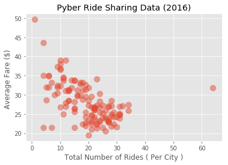
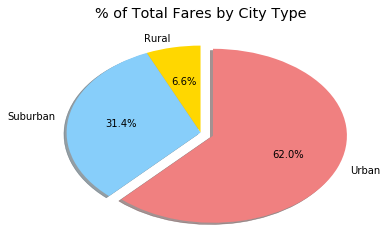
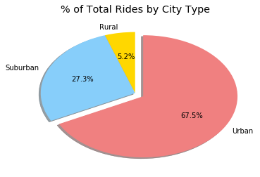
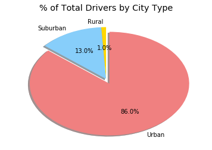

**Pyber Ride Sharing**

** Analysis **

* Observable Trend 1: Urban cities have the most drivers and rides
* Observable Trend 2: Rural cities have the least drivers and rides
* Observable Trend 3:Davidtown and South Bryanstad	( both Urban cities ) have the most drivers

** Dependencies **


```python
import pandas as pd
import numpy as np
import matplotlib.pyplot as plt
#import plotly.plotly.py
%matplotlib inline
```

**Read_CSV**


```python
city_data = pd.read_csv('city_data.csv')
city_data.head()
```


<div>
<style>
    .dataframe thead tr:only-child th {
        text-align: right;
    }

    .dataframe thead th {
        text-align: left;
    }

    .dataframe tbody tr th {
        vertical-align: top;
    }
</style>
<table border="1" class="dataframe">
  <thead>
    <tr style="text-align: right;">
      <th></th>
      <th>city</th>
      <th>driver_count</th>
      <th>type</th>
    </tr>
  </thead>
  <tbody>
    <tr>
      <th>0</th>
      <td>Kelseyland</td>
      <td>63</td>
      <td>Urban</td>
    </tr>
    <tr>
      <th>1</th>
      <td>Nguyenbury</td>
      <td>8</td>
      <td>Urban</td>
    </tr>
    <tr>
      <th>2</th>
      <td>East Douglas</td>
      <td>12</td>
      <td>Urban</td>
    </tr>
    <tr>
      <th>3</th>
      <td>West Dawnfurt</td>
      <td>34</td>
      <td>Urban</td>
    </tr>
    <tr>
      <th>4</th>
      <td>Rodriguezburgh</td>
      <td>52</td>
      <td>Urban</td>
    </tr>
  </tbody>
</table>
</div>


```python
ride_data = pd.read_csv('ride_data.csv')
ride_data.head()
```


<div>
<style>
    .dataframe thead tr:only-child th {
        text-align: right;
    }

    .dataframe thead th {
        text-align: left;
    }

    .dataframe tbody tr th {
        vertical-align: top;
    }
</style>
<table border="1" class="dataframe">
  <thead>
    <tr style="text-align: right;">
      <th></th>
      <th>city</th>
      <th>date</th>
      <th>fare</th>
      <th>ride_id</th>
    </tr>
  </thead>
  <tbody>
    <tr>
      <th>0</th>
      <td>Sarabury</td>
      <td>2016-01-16 13:49:27</td>
      <td>38.35</td>
      <td>5403689035038</td>
    </tr>
    <tr>
      <th>1</th>
      <td>South Roy</td>
      <td>2016-01-02 18:42:34</td>
      <td>17.49</td>
      <td>4036272335942</td>
    </tr>
    <tr>
      <th>2</th>
      <td>Wiseborough</td>
      <td>2016-01-21 17:35:29</td>
      <td>44.18</td>
      <td>3645042422587</td>
    </tr>
    <tr>
      <th>3</th>
      <td>Spencertown</td>
      <td>2016-07-31 14:53:22</td>
      <td>6.87</td>
      <td>2242596575892</td>
    </tr>
    <tr>
      <th>4</th>
      <td>Nguyenbury</td>
      <td>2016-07-09 04:42:44</td>
      <td>6.28</td>
      <td>1543057793673</td>
    </tr>
  </tbody>
</table>
</div>


```python
# observable trend, get the city with the most drivers
city_data.sort_values('driver_count', ascending=False ).head()
```


<div>
<style>
    .dataframe thead tr:only-child th {
        text-align: right;
    }

    .dataframe thead th {
        text-align: left;
    }

    .dataframe tbody tr th {
        vertical-align: top;
    }
</style>
<table border="1" class="dataframe">
  <thead>
    <tr style="text-align: right;">
      <th></th>
      <th>city</th>
      <th>driver_count</th>
      <th>type</th>
    </tr>
  </thead>
  <tbody>
    <tr>
      <th>56</th>
      <td>Davidtown</td>
      <td>73</td>
      <td>Urban</td>
    </tr>
    <tr>
      <th>51</th>
      <td>South Bryanstad</td>
      <td>73</td>
      <td>Urban</td>
    </tr>
    <tr>
      <th>6</th>
      <td>West Sydneyhaven</td>
      <td>70</td>
      <td>Urban</td>
    </tr>
    <tr>
      <th>8</th>
      <td>Torresshire</td>
      <td>70</td>
      <td>Urban</td>
    </tr>
    <tr>
      <th>25</th>
      <td>Williamshire</td>
      <td>70</td>
      <td>Urban</td>
    </tr>
  </tbody>
</table>
</div>


**Merge_DataFrames**


```python
#merge both DataFrame
merge = pd.merge(city_data, ride_data, on = 'city')
merge.head()
```


<div>
<style>
    .dataframe thead tr:only-child th {
        text-align: right;
    }

    .dataframe thead th {
        text-align: left;
    }

    .dataframe tbody tr th {
        vertical-align: top;
    }
</style>
<table border="1" class="dataframe">
  <thead>
    <tr style="text-align: right;">
      <th></th>
      <th>city</th>
      <th>driver_count</th>
      <th>type</th>
      <th>date</th>
      <th>fare</th>
      <th>ride_id</th>
    </tr>
  </thead>
  <tbody>
    <tr>
      <th>0</th>
      <td>Kelseyland</td>
      <td>63</td>
      <td>Urban</td>
      <td>2016-08-19 04:27:52</td>
      <td>5.51</td>
      <td>6246006544795</td>
    </tr>
    <tr>
      <th>1</th>
      <td>Kelseyland</td>
      <td>63</td>
      <td>Urban</td>
      <td>2016-04-17 06:59:50</td>
      <td>5.54</td>
      <td>7466473222333</td>
    </tr>
    <tr>
      <th>2</th>
      <td>Kelseyland</td>
      <td>63</td>
      <td>Urban</td>
      <td>2016-05-04 15:06:07</td>
      <td>30.54</td>
      <td>2140501382736</td>
    </tr>
    <tr>
      <th>3</th>
      <td>Kelseyland</td>
      <td>63</td>
      <td>Urban</td>
      <td>2016-01-25 20:44:56</td>
      <td>12.08</td>
      <td>1896987891309</td>
    </tr>
    <tr>
      <th>4</th>
      <td>Kelseyland</td>
      <td>63</td>
      <td>Urban</td>
      <td>2016-08-09 18:19:47</td>
      <td>17.91</td>
      <td>8784212854829</td>
    </tr>
  </tbody>
</table>
</div>


**Average_Fare_Per_City**


```python
avg_fare = merge.groupby('city')['fare'].mean()
avg_fare.head()

```


    city
    Alvarezhaven    23.928710
    Alyssaberg      20.609615
    Anitamouth      37.315556
    Antoniomouth    23.625000
    Aprilchester    21.981579
    Name: fare, dtype: float64


**Total_Number_Of_Rides_Per_City**


```python
#Total Number of Rides Per City
#num_rides = merge.groupby('city').count()
num_rides = merge.groupby('city')['ride_id'].count()
pd.DataFrame(num_rides)
```


<div>
<style>
    .dataframe thead tr:only-child th {
        text-align: right;
    }

    .dataframe thead th {
        text-align: left;
    }

    .dataframe tbody tr th {
        vertical-align: top;
    }
</style>
<table border="1" class="dataframe">
  <thead>
    <tr style="text-align: right;">
      <th></th>
      <th>ride_id</th>
    </tr>
    <tr>
      <th>city</th>
      <th></th>
    </tr>
  </thead>
  <tbody>
    <tr>
      <th>Alvarezhaven</th>
      <td>31</td>
    </tr>
    <tr>
      <th>Alyssaberg</th>
      <td>26</td>
    </tr>
    <tr>
      <th>Anitamouth</th>
      <td>9</td>
    </tr>
    <tr>
      <th>Antoniomouth</th>
      <td>22</td>
    </tr>
    <tr>
      <th>Aprilchester</th>
      <td>19</td>
    </tr>
    <tr>
      <th>Arnoldview</th>
      <td>31</td>
    </tr>
    <tr>
      <th>Campbellport</th>
      <td>15</td>
    </tr>
    <tr>
      <th>Carrollbury</th>
      <td>10</td>
    </tr>
    <tr>
      <th>Carrollfort</th>
      <td>29</td>
    </tr>
    <tr>
      <th>Clarkstad</th>
      <td>12</td>
    </tr>
    <tr>
      <th>Conwaymouth</th>
      <td>11</td>
    </tr>
    <tr>
      <th>Davidtown</th>
      <td>21</td>
    </tr>
    <tr>
      <th>Davistown</th>
      <td>25</td>
    </tr>
    <tr>
      <th>East Cherylfurt</th>
      <td>13</td>
    </tr>
    <tr>
      <th>East Douglas</th>
      <td>22</td>
    </tr>
    <tr>
      <th>East Erin</th>
      <td>28</td>
    </tr>
    <tr>
      <th>East Jenniferchester</th>
      <td>19</td>
    </tr>
    <tr>
      <th>East Leslie</th>
      <td>11</td>
    </tr>
    <tr>
      <th>East Stephen</th>
      <td>10</td>
    </tr>
    <tr>
      <th>East Troybury</th>
      <td>7</td>
    </tr>
    <tr>
      <th>Edwardsbury</th>
      <td>27</td>
    </tr>
    <tr>
      <th>Erikport</th>
      <td>8</td>
    </tr>
    <tr>
      <th>Eriktown</th>
      <td>19</td>
    </tr>
    <tr>
      <th>Floresberg</th>
      <td>10</td>
    </tr>
    <tr>
      <th>Fosterside</th>
      <td>24</td>
    </tr>
    <tr>
      <th>Hernandezshire</th>
      <td>9</td>
    </tr>
    <tr>
      <th>Horneland</th>
      <td>4</td>
    </tr>
    <tr>
      <th>Jacksonfort</th>
      <td>6</td>
    </tr>
    <tr>
      <th>Jacobfort</th>
      <td>31</td>
    </tr>
    <tr>
      <th>Jasonfort</th>
      <td>12</td>
    </tr>
    <tr>
      <th>...</th>
      <td>...</td>
    </tr>
    <tr>
      <th>South Roy</th>
      <td>22</td>
    </tr>
    <tr>
      <th>South Shannonborough</th>
      <td>15</td>
    </tr>
    <tr>
      <th>Spencertown</th>
      <td>26</td>
    </tr>
    <tr>
      <th>Stevensport</th>
      <td>5</td>
    </tr>
    <tr>
      <th>Stewartview</th>
      <td>30</td>
    </tr>
    <tr>
      <th>Swansonbury</th>
      <td>34</td>
    </tr>
    <tr>
      <th>Thomastown</th>
      <td>24</td>
    </tr>
    <tr>
      <th>Tiffanyton</th>
      <td>13</td>
    </tr>
    <tr>
      <th>Torresshire</th>
      <td>26</td>
    </tr>
    <tr>
      <th>Travisville</th>
      <td>23</td>
    </tr>
    <tr>
      <th>Vickimouth</th>
      <td>15</td>
    </tr>
    <tr>
      <th>Webstertown</th>
      <td>16</td>
    </tr>
    <tr>
      <th>West Alexis</th>
      <td>20</td>
    </tr>
    <tr>
      <th>West Brandy</th>
      <td>30</td>
    </tr>
    <tr>
      <th>West Brittanyton</th>
      <td>24</td>
    </tr>
    <tr>
      <th>West Dawnfurt</th>
      <td>29</td>
    </tr>
    <tr>
      <th>West Evan</th>
      <td>12</td>
    </tr>
    <tr>
      <th>West Jefferyfurt</th>
      <td>21</td>
    </tr>
    <tr>
      <th>West Kevintown</th>
      <td>7</td>
    </tr>
    <tr>
      <th>West Oscar</th>
      <td>29</td>
    </tr>
    <tr>
      <th>West Pamelaborough</th>
      <td>14</td>
    </tr>
    <tr>
      <th>West Paulport</th>
      <td>17</td>
    </tr>
    <tr>
      <th>West Peter</th>
      <td>31</td>
    </tr>
    <tr>
      <th>West Sydneyhaven</th>
      <td>18</td>
    </tr>
    <tr>
      <th>West Tony</th>
      <td>19</td>
    </tr>
    <tr>
      <th>Williamchester</th>
      <td>11</td>
    </tr>
    <tr>
      <th>Williamshire</th>
      <td>31</td>
    </tr>
    <tr>
      <th>Wiseborough</th>
      <td>19</td>
    </tr>
    <tr>
      <th>Yolandafurt</th>
      <td>20</td>
    </tr>
    <tr>
      <th>Zimmermanmouth</th>
      <td>24</td>
    </tr>
  </tbody>
</table>
<p>125 rows × 1 columns</p>
</div>


**Total_Number_Of_Drivers_Per_City**


```python
#Total Number of Drivers Per City
num_drive = merge[ ['city','driver_count' ]].drop_duplicates()
num_drive
```


      File "<ipython-input-739-c813ab3a8268>", line 2
        num_drive = merge[ ['city','driver_count' ], axis=0 ].drop_duplicates()
                                                         ^
    SyntaxError: invalid syntax
    


**City_Type**


```python
#City Type (Urban, Suburban, Rural)
city_type = merge.groupby('type')
city_type.head()
```


<div>
<style>
    .dataframe thead tr:only-child th {
        text-align: right;
    }

    .dataframe thead th {
        text-align: left;
    }

    .dataframe tbody tr th {
        vertical-align: top;
    }
</style>
<table border="1" class="dataframe">
  <thead>
    <tr style="text-align: right;">
      <th></th>
      <th>city</th>
      <th>driver_count</th>
      <th>type</th>
      <th>date</th>
      <th>fare</th>
      <th>ride_id</th>
    </tr>
  </thead>
  <tbody>
    <tr>
      <th>0</th>
      <td>Kelseyland</td>
      <td>63</td>
      <td>Urban</td>
      <td>2016-08-19 04:27:52</td>
      <td>5.51</td>
      <td>6246006544795</td>
    </tr>
    <tr>
      <th>1</th>
      <td>Kelseyland</td>
      <td>63</td>
      <td>Urban</td>
      <td>2016-04-17 06:59:50</td>
      <td>5.54</td>
      <td>7466473222333</td>
    </tr>
    <tr>
      <th>2</th>
      <td>Kelseyland</td>
      <td>63</td>
      <td>Urban</td>
      <td>2016-05-04 15:06:07</td>
      <td>30.54</td>
      <td>2140501382736</td>
    </tr>
    <tr>
      <th>3</th>
      <td>Kelseyland</td>
      <td>63</td>
      <td>Urban</td>
      <td>2016-01-25 20:44:56</td>
      <td>12.08</td>
      <td>1896987891309</td>
    </tr>
    <tr>
      <th>4</th>
      <td>Kelseyland</td>
      <td>63</td>
      <td>Urban</td>
      <td>2016-08-09 18:19:47</td>
      <td>17.91</td>
      <td>8784212854829</td>
    </tr>
    <tr>
      <th>1625</th>
      <td>Carrollbury</td>
      <td>4</td>
      <td>Suburban</td>
      <td>2016-05-09 03:12:10</td>
      <td>25.00</td>
      <td>485795568537</td>
    </tr>
    <tr>
      <th>1626</th>
      <td>Carrollbury</td>
      <td>4</td>
      <td>Suburban</td>
      <td>2016-06-09 05:04:24</td>
      <td>49.47</td>
      <td>617204620844</td>
    </tr>
    <tr>
      <th>1627</th>
      <td>Carrollbury</td>
      <td>4</td>
      <td>Suburban</td>
      <td>2016-05-20 06:12:36</td>
      <td>35.33</td>
      <td>73368831241</td>
    </tr>
    <tr>
      <th>1628</th>
      <td>Carrollbury</td>
      <td>4</td>
      <td>Suburban</td>
      <td>2016-03-21 17:31:26</td>
      <td>20.26</td>
      <td>7948046018548</td>
    </tr>
    <tr>
      <th>1629</th>
      <td>Carrollbury</td>
      <td>4</td>
      <td>Suburban</td>
      <td>2016-08-20 11:20:51</td>
      <td>46.67</td>
      <td>4786094151694</td>
    </tr>
    <tr>
      <th>2282</th>
      <td>South Elizabethmouth</td>
      <td>3</td>
      <td>Rural</td>
      <td>2016-04-03 11:13:07</td>
      <td>22.79</td>
      <td>8193837300497</td>
    </tr>
    <tr>
      <th>2283</th>
      <td>South Elizabethmouth</td>
      <td>3</td>
      <td>Rural</td>
      <td>2016-03-11 12:27:01</td>
      <td>26.72</td>
      <td>4943246873754</td>
    </tr>
    <tr>
      <th>2284</th>
      <td>South Elizabethmouth</td>
      <td>3</td>
      <td>Rural</td>
      <td>2016-11-23 07:47:18</td>
      <td>46.39</td>
      <td>1939838068038</td>
    </tr>
    <tr>
      <th>2285</th>
      <td>South Elizabethmouth</td>
      <td>3</td>
      <td>Rural</td>
      <td>2016-07-19 09:35:59</td>
      <td>31.09</td>
      <td>2959749591417</td>
    </tr>
    <tr>
      <th>2286</th>
      <td>South Elizabethmouth</td>
      <td>3</td>
      <td>Rural</td>
      <td>2016-04-21 10:20:09</td>
      <td>16.50</td>
      <td>5702608059064</td>
    </tr>
  </tbody>
</table>
</div>


**Bubble_Plot**


```python
#plt.legend(['b', 'c', 'y','m','r'])
#colors=['b', 'c', 'y','m','r']
#oo = pd.DataFrame([b,a])
#x = oo.iloc[0]
#y = oo.iloc[1]

x = num_rides
y = avg_fare
z = num_drive
#plt.scatter(x,y, labels = 'Number of Rides', color = 'r')
plt.scatter(x, y, s=100, alpha=0.5 )
plt.xlabel('Total Number of Rides ( Per City )')
plt.ylabel('Average Fare ($) ')
plt.title('Pyber Ride Sharing Data (2016)')
#pd.DataFrame([ num_rides, avg_fare, num_drive ]).T
```


    Text(0.5,1,'Pyber Ride Sharing Data (2016)')





**Pie Chart**

** % of Total Fares by City Type ** 


```python
# fare by city type 
fare = merge.groupby('type')['fare'].sum()
fare
```


    type
    Rural        4255.09
    Suburban    20335.69
    Urban       40078.34
    Name: fare, dtype: float64


```python
#total fare
total_fare = fare[0] + fare[1] + fare[2]
total_fare
```


    64669.119999999966


```python
# pie chart labels
labels = [ fare.index[0], fare.index[1], fare.index[2] ]
labels

```


    ['Rural', 'Suburban', 'Urban']


```python
# calculate percentages 
per_fare = [ ( fare[i]/ total_fare ) * 100 for i in range(3)]
per_fare
```


    [6.5797864575859428, 31.445750305555404, 61.974463236858654]


```python
# plot the numbers
fig1, ax1 = plt.subplots()
colors = [ 'gold', 'lightskyblue', 'lightcoral']
explode = (0, 0, 0.1 ) 
ax1.pie(per_fare, explode=explode, labels=labels, autopct='%1.1f%%',  shadow=True, startangle=90, colors=colors)
plt.title('% of Total Fares by City Type')
```


    Text(0.5,1,'% of Total Fares by City Type')





** % of Total Rides by City Type ** 


```python
# get rides by city
rides = merge.groupby('type')['ride_id'].count()
rides
```


    type
    Rural        125
    Suburban     657
    Urban       1625
    Name: ride_id, dtype: int64


```python
# total number of rides 
total_rides = rides[0] + rides[1] + rides[2]
total_rides
```


    2407


```python
# percentages
per_rides = [ ( rides[i]/ total_rides ) * 100 for i in range(3)]
per_rides
```


    [5.1931865392604903, 27.295388450353137, 67.511425010386375]


```python
# plot
fig2, ax2 = plt.subplots()
ax2.pie(per_rides, labels=labels, autopct='%1.1f%%', shadow=True, startangle=90, colors=colors, explode=explode)
plt.title('% of Total Rides by City Type')
```


    Text(0.5,1,'% of Total Rides by City Type')





** % of Total Drivers by City Type **


```python
# drivers by city type
drivers = merge.groupby('type')['driver_count'].sum()
drivers
```


    type
    Rural         727
    Suburban     9730
    Urban       64501
    Name: driver_count, dtype: int64


```python
# total number of drivers
total_drivers = drivers[0] + drivers[1] + drivers[2]
total_drivers
```


    74958


```python
# percentage
per_drivers = [ ( drivers[i]/ total_drivers ) * 100 for i in range(3)]
per_drivers
```


    [0.96987646415325912, 12.980602470716935, 86.049521065129809]


```python
fig3, ax3 = plt.subplots()
ax3.pie(per_drivers, labels=labels, autopct='%1.1f%%', shadow=True, startangle=90, colors=colors, explode=explode)
plt.title('% of Total Drivers by City Type')
```


    Text(0.5,1,'% of Total Drivers by City Type')




