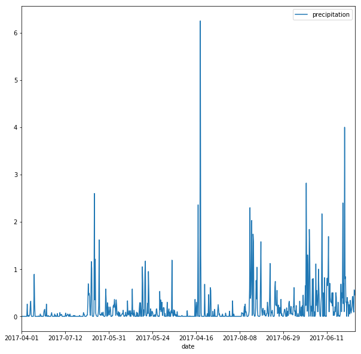
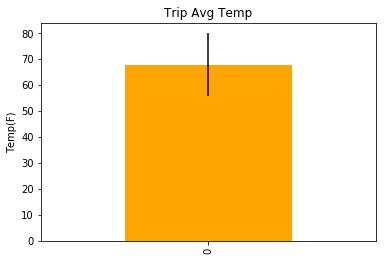

```python
import pandas as pd
import numpy as np
import matplotlib.pyplot as plt
import datetime
%matplotlib inline
```

## Step 1

### Read measurements CSV


```python
# read measurements csv
csv1 = pd.read_csv("hawaii_measurements.csv", dtype=object)
csv1.head()
```


<div>
<style>
    .dataframe thead tr:only-child th {
        text-align: right;
    }

    .dataframe thead th {
        text-align: left;
    }

    .dataframe tbody tr th {
        vertical-align: top;
    }
</style>
<table border="1" class="dataframe">
  <thead>
    <tr style="text-align: right;">
      <th></th>
      <th>station</th>
      <th>date</th>
      <th>prcp</th>
      <th>tobs</th>
    </tr>
  </thead>
  <tbody>
    <tr>
      <th>0</th>
      <td>USC00519397</td>
      <td>2010-01-01</td>
      <td>0.08</td>
      <td>65</td>
    </tr>
    <tr>
      <th>1</th>
      <td>USC00519397</td>
      <td>2010-01-02</td>
      <td>0</td>
      <td>63</td>
    </tr>
    <tr>
      <th>2</th>
      <td>USC00519397</td>
      <td>2010-01-03</td>
      <td>0</td>
      <td>74</td>
    </tr>
    <tr>
      <th>3</th>
      <td>USC00519397</td>
      <td>2010-01-04</td>
      <td>0</td>
      <td>76</td>
    </tr>
    <tr>
      <th>4</th>
      <td>USC00519397</td>
      <td>2010-01-06</td>
      <td>NaN</td>
      <td>73</td>
    </tr>
  </tbody>
</table>
</div>


```python
# cleaned csv by dropping the rows with NAN
measurements=file1.dropna(axis=0)
# saved cleaned file to a new csv
measurements.to_csv("clean_hawaii_measurements.csv", index=False)
measurements
measurements.head()

```


<div>
<style>
    .dataframe thead tr:only-child th {
        text-align: right;
    }

    .dataframe thead th {
        text-align: left;
    }

    .dataframe tbody tr th {
        vertical-align: top;
    }
</style>
<table border="1" class="dataframe">
  <thead>
    <tr style="text-align: right;">
      <th></th>
      <th>station</th>
      <th>date</th>
      <th>prcp</th>
      <th>tobs</th>
    </tr>
  </thead>
  <tbody>
    <tr>
      <th>0</th>
      <td>USC00519397</td>
      <td>2010-01-01</td>
      <td>0.08</td>
      <td>65</td>
    </tr>
    <tr>
      <th>1</th>
      <td>USC00519397</td>
      <td>2010-01-02</td>
      <td>0</td>
      <td>63</td>
    </tr>
    <tr>
      <th>2</th>
      <td>USC00519397</td>
      <td>2010-01-03</td>
      <td>0</td>
      <td>74</td>
    </tr>
    <tr>
      <th>3</th>
      <td>USC00519397</td>
      <td>2010-01-04</td>
      <td>0</td>
      <td>76</td>
    </tr>
    <tr>
      <th>5</th>
      <td>USC00519397</td>
      <td>2010-01-07</td>
      <td>0.06</td>
      <td>70</td>
    </tr>
  </tbody>
</table>
</div>


### Read stations CSV


```python
# Read hawaii csv
csv2 = pd.read_csv("hawaii_stations.csv", dtype='object')
csv2.head()
```


<div>
<style>
    .dataframe thead tr:only-child th {
        text-align: right;
    }

    .dataframe thead th {
        text-align: left;
    }

    .dataframe tbody tr th {
        vertical-align: top;
    }
</style>
<table border="1" class="dataframe">
  <thead>
    <tr style="text-align: right;">
      <th></th>
      <th>station</th>
      <th>name</th>
      <th>latitude</th>
      <th>longitude</th>
      <th>elevation</th>
    </tr>
  </thead>
  <tbody>
    <tr>
      <th>0</th>
      <td>USC00519397</td>
      <td>WAIKIKI 717.2, HI US</td>
      <td>21.2716</td>
      <td>-157.8168</td>
      <td>3</td>
    </tr>
    <tr>
      <th>1</th>
      <td>USC00513117</td>
      <td>KANEOHE 838.1, HI US</td>
      <td>21.4234</td>
      <td>-157.8015</td>
      <td>14.6</td>
    </tr>
    <tr>
      <th>2</th>
      <td>USC00514830</td>
      <td>KUALOA RANCH HEADQUARTERS 886.9, HI US</td>
      <td>21.5213</td>
      <td>-157.8374</td>
      <td>7</td>
    </tr>
    <tr>
      <th>3</th>
      <td>USC00517948</td>
      <td>PEARL CITY, HI US</td>
      <td>21.3934</td>
      <td>-157.9751</td>
      <td>11.9</td>
    </tr>
    <tr>
      <th>4</th>
      <td>USC00518838</td>
      <td>UPPER WAHIAWA 874.3, HI US</td>
      <td>21.4992</td>
      <td>-158.0111</td>
      <td>306.6</td>
    </tr>
  </tbody>
</table>
</div>


```python
# cleaned csv by dropping the rows with NAN
stations=csv2.dropna(axis=0)
# saved cleaned file to new csv
stations.to_csv("clean_hawaii_stations.csv", index=False)
stations.head()
```


<div>
<style>
    .dataframe thead tr:only-child th {
        text-align: right;
    }

    .dataframe thead th {
        text-align: left;
    }

    .dataframe tbody tr th {
        vertical-align: top;
    }
</style>
<table border="1" class="dataframe">
  <thead>
    <tr style="text-align: right;">
      <th></th>
      <th>station</th>
      <th>name</th>
      <th>latitude</th>
      <th>longitude</th>
      <th>elevation</th>
    </tr>
  </thead>
  <tbody>
    <tr>
      <th>0</th>
      <td>USC00519397</td>
      <td>WAIKIKI 717.2, HI US</td>
      <td>21.2716</td>
      <td>-157.8168</td>
      <td>3</td>
    </tr>
    <tr>
      <th>1</th>
      <td>USC00513117</td>
      <td>KANEOHE 838.1, HI US</td>
      <td>21.4234</td>
      <td>-157.8015</td>
      <td>14.6</td>
    </tr>
    <tr>
      <th>2</th>
      <td>USC00514830</td>
      <td>KUALOA RANCH HEADQUARTERS 886.9, HI US</td>
      <td>21.5213</td>
      <td>-157.8374</td>
      <td>7</td>
    </tr>
    <tr>
      <th>3</th>
      <td>USC00517948</td>
      <td>PEARL CITY, HI US</td>
      <td>21.3934</td>
      <td>-157.9751</td>
      <td>11.9</td>
    </tr>
    <tr>
      <th>4</th>
      <td>USC00518838</td>
      <td>UPPER WAHIAWA 874.3, HI US</td>
      <td>21.4992</td>
      <td>-158.0111</td>
      <td>306.6</td>
    </tr>
  </tbody>
</table>
</div>


## Step 2


```python
# Python SQL toolkit and object Relational Mapper
import sqlalchemy
from sqlalchemy import create_engine, MetaData
from sqlalchemy.ext.declarative import declarative_base
from sqlalchemy.ext.automap import automap_base
from sqlalchemy import Column, Integer, String, Numeric, Text, Float, Date
```


```python
# csv data
m = pd.read_csv("clean_hawaii_measurements.csv")
s = pd.read_csv("clean_hawaii_stations.csv")
```


```python
# create database
engine = create_engine("sqlite:///hawaii.sqlite")
```


```python
# create a connection to the database
conn = engine.connect()
```


```python
# use declarative_base to create ORM class for each table
Base = declarative_base()

class Measurement(Base):
    __tablename__='measurements'
    
    id = Column(Integer, primary_key=True)
    station = Column(Text)
    date = Column(Date)
    prcp = Column(Float)
    tobs = Column(Integer)
    
    def __repr__(self):
        return f"id={self.id}, name={self.name}"
    
```


```python
class Station(Base):
    __tablename__ = 'stations'
    
    id = Column(Integer, primary_key=True)
    station = Column(Text)
    name = Column(Text)
    latitude = Column(Float)
    longitude = Column(Float)
    elevation = Column(Float)
    
    def __repr__(self):
        return f"id={self.id}, name={self.name}"
```


```python
Base.metadata.create_all(engine)
```


```python
# Use Orient="records"s to create to a list of data to write
mdata = m.to_dict(orient="records")
sdata = s.to_dict(orient="records")
```


```python
# convert string to date object for `date` column
for item in mdata:
    item["date"] = datetime.datetime.strptime(item["date"], "%Y-%m-%d").date()
```


```python
# Use MetaData from SQLAlchemy to reflect the tables
metadata = MetaData(bind=engine)
metadata.reflect()
```


```python
# Save the reference to the as variables
table1 = sqlalchemy.Table("measurements", metadata, autoload=True)
table2 = sqlalchemy.Table("stations", metadata, autoload=True)
```


```python
# Remove any existing data
conn.execute(table1.delete())
conn.execute(table2.delete())
```


    <sqlalchemy.engine.result.ResultProxy at 0x1ca0d7c1390>


```python
#  Insert data into database
conn.execute(table1.insert(), mdata)
conn.execute(table2.insert(), sdata)
```


    <sqlalchemy.engine.result.ResultProxy at 0x1ca0d6f04a8>


## Step 3


```python
# Connect to database
engine = create_engine("sqlite:///hawaii.sqlite")
conn = engine.connect()
```


```python
Base = automap_base()

```


```python
Base.prepare(engine, reflect=True)
```


```python
Station = Base.classes.stations
```


```python
Measurement = Base.classes.measurements
```

## Percipitation Analysis


```python
# Last 12 months of percipitation
query = "select date, prcp from measurements where date >= date('now', 'start of month', '-12 month') AND date < date('now','start of month')"
```


```python
results = conn.execute(query).fetchall()

```


```python
# Load into dataframe
prcp = pd.DataFrame(results, columns=["date", "precipitation"])
prcp.head()
```


<div>
<style>
    .dataframe thead tr:only-child th {
        text-align: right;
    }

    .dataframe thead th {
        text-align: left;
    }

    .dataframe tbody tr th {
        vertical-align: top;
    }
</style>
<table border="1" class="dataframe">
  <thead>
    <tr style="text-align: right;">
      <th></th>
      <th>date</th>
      <th>precipitation</th>
    </tr>
  </thead>
  <tbody>
    <tr>
      <th>0</th>
      <td>2017-04-01</td>
      <td>0.0</td>
    </tr>
    <tr>
      <th>1</th>
      <td>2017-04-02</td>
      <td>0.0</td>
    </tr>
    <tr>
      <th>2</th>
      <td>2017-04-03</td>
      <td>0.0</td>
    </tr>
    <tr>
      <th>3</th>
      <td>2017-04-04</td>
      <td>0.0</td>
    </tr>
    <tr>
      <th>4</th>
      <td>2017-04-05</td>
      <td>0.0</td>
    </tr>
  </tbody>
</table>
</div>


```python
# Set date column as index
prcp.set_index('date', inplace=True)
prcp.head()
```


<div>
<style>
    .dataframe thead tr:only-child th {
        text-align: right;
    }

    .dataframe thead th {
        text-align: left;
    }

    .dataframe tbody tr th {
        vertical-align: top;
    }
</style>
<table border="1" class="dataframe">
  <thead>
    <tr style="text-align: right;">
      <th></th>
      <th>precipitation</th>
    </tr>
    <tr>
      <th>date</th>
      <th></th>
    </tr>
  </thead>
  <tbody>
    <tr>
      <th>2017-04-01</th>
      <td>0.0</td>
    </tr>
    <tr>
      <th>2017-04-02</th>
      <td>0.0</td>
    </tr>
    <tr>
      <th>2017-04-03</th>
      <td>0.0</td>
    </tr>
    <tr>
      <th>2017-04-04</th>
      <td>0.0</td>
    </tr>
    <tr>
      <th>2017-04-05</th>
      <td>0.0</td>
    </tr>
  </tbody>
</table>
</div>


```python
# Plot
prcp.reset_index().plot(x='date', y='precipitation', figsize=(10,10))
```


    <matplotlib.axes._subplots.AxesSubplot at 0x1ca0b450668>





```python
# Summary statistics
prcp.describe()
```


<div>
<style>
    .dataframe thead tr:only-child th {
        text-align: right;
    }

    .dataframe thead th {
        text-align: left;
    }

    .dataframe tbody tr th {
        vertical-align: top;
    }
</style>
<table border="1" class="dataframe">
  <thead>
    <tr style="text-align: right;">
      <th></th>
      <th>precipitation</th>
    </tr>
  </thead>
  <tbody>
    <tr>
      <th>count</th>
      <td>766.000000</td>
    </tr>
    <tr>
      <th>mean</th>
      <td>0.169191</td>
    </tr>
    <tr>
      <th>std</th>
      <td>0.429827</td>
    </tr>
    <tr>
      <th>min</th>
      <td>0.000000</td>
    </tr>
    <tr>
      <th>25%</th>
      <td>0.000000</td>
    </tr>
    <tr>
      <th>50%</th>
      <td>0.020000</td>
    </tr>
    <tr>
      <th>75%</th>
      <td>0.140000</td>
    </tr>
    <tr>
      <th>max</th>
      <td>6.250000</td>
    </tr>
  </tbody>
</table>
</div>


## Station Analysis


```python
# Calculate the total number of stations
query = "select count(distinct name) from stations"
conn.execute(query).fetchall()[0][0]
```


    9


```python
# List the stations and observation counts in descending order
query = "select stations.name,count(measurements.tobs) as count from stations join measurements on stations.station=measurements.station group by name order by count desc"
conn.execute(query).fetchall()
```


    [('WAIHEE 837.5, HI US', 2772),
     ('KANEOHE 838.1, HI US', 2696),
     ('WAIKIKI 717.2, HI US', 2685),
     ('WAIMANALO EXPERIMENTAL FARM, HI US', 2572),
     ('MANOA LYON ARBO 785.2, HI US', 2484),
     ('KUALOA RANCH HEADQUARTERS 886.9, HI US', 1937),
     ('HONOLULU OBSERVATORY 702.2, HI US', 1932),
     ('PEARL CITY, HI US', 683),
     ('UPPER WAHIAWA 874.3, HI US', 342)]


```python
# Which station has the highest number of observation?
query = "select stations.name, count(measurements.tobs) as count from stations join measurements on stations.station=measurements.station group by name order by count desc limit 1"
conn.execute(query).fetchall()
```


    [('WAIHEE 837.5, HI US', 2772)]


```python
# Last 12 months of tobs
query = '''select stations.name,measurements.tobs, measurements.date from measurements
join stations on stations.station=measurements.station
where measurements.date >=date('now', 'start of month', '-12 month')
AND measurements.date < date('now', 'start of month')'''
conn.execute(query).fetchall()
```


    [('WAIKIKI 717.2, HI US', 76, '2017-04-01'),
     ('WAIKIKI 717.2, HI US', 76, '2017-04-02'),
     ('WAIKIKI 717.2, HI US', 77, '2017-04-03'),
     ('WAIKIKI 717.2, HI US', 76, '2017-04-04'),
     ('WAIKIKI 717.2, HI US', 78, '2017-04-05'),
     ('WAIKIKI 717.2, HI US', 77, '2017-04-06'),
     ('WAIKIKI 717.2, HI US', 77, '2017-04-07'),
     ('WAIKIKI 717.2, HI US', 77, '2017-04-08'),
     ('WAIKIKI 717.2, HI US', 72, '2017-04-09'),
     ('WAIKIKI 717.2, HI US', 75, '2017-04-10'),
     ('WAIKIKI 717.2, HI US', 79, '2017-04-11'),
     ('WAIKIKI 717.2, HI US', 78, '2017-04-12'),
     ('WAIKIKI 717.2, HI US', 77, '2017-04-13'),
     ('WAIKIKI 717.2, HI US', 75, '2017-04-14'),
     ('WAIKIKI 717.2, HI US', 73, '2017-04-15'),
     ('WAIKIKI 717.2, HI US', 74, '2017-04-16'),
     ('WAIKIKI 717.2, HI US', 74, '2017-04-17'),
     ('WAIKIKI 717.2, HI US', 75, '2017-04-18'),
     ('WAIKIKI 717.2, HI US', 74, '2017-04-19'),
     ('WAIKIKI 717.2, HI US', 78, '2017-04-20'),
     ('WAIKIKI 717.2, HI US', 73, '2017-04-21'),
     ('WAIKIKI 717.2, HI US', 76, '2017-04-22'),
     ('WAIKIKI 717.2, HI US', 77, '2017-04-23'),
     ('WAIKIKI 717.2, HI US', 77, '2017-04-24'),
     ('WAIKIKI 717.2, HI US', 77, '2017-04-25'),
     ('WAIKIKI 717.2, HI US', 77, '2017-04-26'),
     ('WAIKIKI 717.2, HI US', 78, '2017-04-27'),
     ('WAIKIKI 717.2, HI US', 76, '2017-04-28'),
     ('WAIKIKI 717.2, HI US', 72, '2017-04-29'),
     ('WAIKIKI 717.2, HI US', 63, '2017-04-30'),
     ('WAIKIKI 717.2, HI US', 75, '2017-05-01'),
     ('WAIKIKI 717.2, HI US', 78, '2017-05-02'),
     ('WAIKIKI 717.2, HI US', 78, '2017-05-03'),
     ('WAIKIKI 717.2, HI US', 78, '2017-05-04'),
     ('WAIKIKI 717.2, HI US', 79, '2017-05-05'),
     ('WAIKIKI 717.2, HI US', 79, '2017-05-06'),
     ('WAIKIKI 717.2, HI US', 79, '2017-05-07'),
     ('WAIKIKI 717.2, HI US', 77, '2017-05-08'),
     ('WAIKIKI 717.2, HI US', 78, '2017-05-10'),
     ('WAIKIKI 717.2, HI US', 78, '2017-05-11'),
     ('WAIKIKI 717.2, HI US', 79, '2017-05-12'),
     ('WAIKIKI 717.2, HI US', 79, '2017-05-13'),
     ('WAIKIKI 717.2, HI US', 77, '2017-05-14'),
     ('WAIKIKI 717.2, HI US', 78, '2017-05-15'),
     ('WAIKIKI 717.2, HI US', 78, '2017-05-16'),
     ('WAIKIKI 717.2, HI US', 78, '2017-05-17'),
     ('WAIKIKI 717.2, HI US', 73, '2017-05-18'),
     ('WAIKIKI 717.2, HI US', 76, '2017-05-19'),
     ('WAIKIKI 717.2, HI US', 78, '2017-05-20'),
     ('WAIKIKI 717.2, HI US', 76, '2017-05-21'),
     ('WAIKIKI 717.2, HI US', 77, '2017-05-22'),
     ('WAIKIKI 717.2, HI US', 87, '2017-05-23'),
     ('WAIKIKI 717.2, HI US', 77, '2017-05-24'),
     ('WAIKIKI 717.2, HI US', 77, '2017-05-25'),
     ('WAIKIKI 717.2, HI US', 74, '2017-05-27'),
     ('WAIKIKI 717.2, HI US', 76, '2017-05-28'),
     ('WAIKIKI 717.2, HI US', 75, '2017-05-29'),
     ('WAIKIKI 717.2, HI US', 76, '2017-05-30'),
     ('WAIKIKI 717.2, HI US', 79, '2017-05-31'),
     ('WAIKIKI 717.2, HI US', 79, '2017-06-01'),
     ('WAIKIKI 717.2, HI US', 79, '2017-06-02'),
     ('WAIKIKI 717.2, HI US', 79, '2017-06-03'),
     ('WAIKIKI 717.2, HI US', 79, '2017-06-04'),
     ('WAIKIKI 717.2, HI US', 80, '2017-06-05'),
     ('WAIKIKI 717.2, HI US', 79, '2017-06-06'),
     ('WAIKIKI 717.2, HI US', 79, '2017-06-07'),
     ('WAIKIKI 717.2, HI US', 80, '2017-06-08'),
     ('WAIKIKI 717.2, HI US', 80, '2017-06-09'),
     ('WAIKIKI 717.2, HI US', 77, '2017-06-10'),
     ('WAIKIKI 717.2, HI US', 79, '2017-06-11'),
     ('WAIKIKI 717.2, HI US', 83, '2017-06-12'),
     ('WAIKIKI 717.2, HI US', 80, '2017-06-13'),
     ('WAIKIKI 717.2, HI US', 80, '2017-06-14'),
     ('WAIKIKI 717.2, HI US', 78, '2017-06-15'),
     ('WAIKIKI 717.2, HI US', 79, '2017-06-16'),
     ('WAIKIKI 717.2, HI US', 80, '2017-06-17'),
     ('WAIKIKI 717.2, HI US', 77, '2017-06-18'),
     ('WAIKIKI 717.2, HI US', 80, '2017-06-19'),
     ('WAIKIKI 717.2, HI US', 78, '2017-06-20'),
     ('WAIKIKI 717.2, HI US', 79, '2017-06-21'),
     ('WAIKIKI 717.2, HI US', 80, '2017-06-22'),
     ('WAIKIKI 717.2, HI US', 78, '2017-06-23'),
     ('WAIKIKI 717.2, HI US', 80, '2017-06-24'),
     ('WAIKIKI 717.2, HI US', 80, '2017-06-25'),
     ('WAIKIKI 717.2, HI US', 81, '2017-06-26'),
     ('WAIKIKI 717.2, HI US', 80, '2017-06-27'),
     ('WAIKIKI 717.2, HI US', 79, '2017-06-28'),
     ('WAIKIKI 717.2, HI US', 79, '2017-06-29'),
     ('WAIKIKI 717.2, HI US', 75, '2017-06-30'),
     ('WAIKIKI 717.2, HI US', 80, '2017-07-01'),
     ('WAIKIKI 717.2, HI US', 80, '2017-07-02'),
     ('WAIKIKI 717.2, HI US', 78, '2017-07-03'),
     ('WAIKIKI 717.2, HI US', 80, '2017-07-04'),
     ('WAIKIKI 717.2, HI US', 80, '2017-07-05'),
     ('WAIKIKI 717.2, HI US', 81, '2017-07-06'),
     ('WAIKIKI 717.2, HI US', 79, '2017-07-07'),
     ('WAIKIKI 717.2, HI US', 80, '2017-07-08'),
     ('WAIKIKI 717.2, HI US', 80, '2017-07-09'),
     ('WAIKIKI 717.2, HI US', 80, '2017-07-10'),
     ('WAIKIKI 717.2, HI US', 78, '2017-07-11'),
     ('WAIKIKI 717.2, HI US', 81, '2017-07-12'),
     ('WAIKIKI 717.2, HI US', 79, '2017-07-13'),
     ('WAIKIKI 717.2, HI US', 81, '2017-07-14'),
     ('WAIKIKI 717.2, HI US', 80, '2017-07-15'),
     ('WAIKIKI 717.2, HI US', 78, '2017-07-16'),
     ('WAIKIKI 717.2, HI US', 80, '2017-07-17'),
     ('WAIKIKI 717.2, HI US', 80, '2017-07-18'),
     ('WAIKIKI 717.2, HI US', 80, '2017-07-20'),
     ('WAIKIKI 717.2, HI US', 80, '2017-07-21'),
     ('WAIKIKI 717.2, HI US', 81, '2017-07-22'),
     ('WAIKIKI 717.2, HI US', 81, '2017-07-23'),
     ('WAIKIKI 717.2, HI US', 78, '2017-07-24'),
     ('WAIKIKI 717.2, HI US', 80, '2017-07-25'),
     ('WAIKIKI 717.2, HI US', 82, '2017-07-26'),
     ('WAIKIKI 717.2, HI US', 79, '2017-07-27'),
     ('WAIKIKI 717.2, HI US', 81, '2017-07-28'),
     ('WAIKIKI 717.2, HI US', 81, '2017-07-29'),
     ('WAIKIKI 717.2, HI US', 81, '2017-07-30'),
     ('WAIKIKI 717.2, HI US', 80, '2017-07-31'),
     ('WAIKIKI 717.2, HI US', 77, '2017-08-01'),
     ('WAIKIKI 717.2, HI US', 73, '2017-08-02'),
     ('WAIKIKI 717.2, HI US', 79, '2017-08-03'),
     ('WAIKIKI 717.2, HI US', 80, '2017-08-04'),
     ('WAIKIKI 717.2, HI US', 81, '2017-08-05'),
     ('WAIKIKI 717.2, HI US', 80, '2017-08-06'),
     ('WAIKIKI 717.2, HI US', 80, '2017-08-07'),
     ('WAIKIKI 717.2, HI US', 80, '2017-08-08'),
     ('WAIKIKI 717.2, HI US', 80, '2017-08-09'),
     ('WAIKIKI 717.2, HI US', 81, '2017-08-10'),
     ('WAIKIKI 717.2, HI US', 78, '2017-08-11'),
     ('WAIKIKI 717.2, HI US', 80, '2017-08-12'),
     ('WAIKIKI 717.2, HI US', 81, '2017-08-13'),
     ('WAIKIKI 717.2, HI US', 79, '2017-08-14'),
     ('WAIKIKI 717.2, HI US', 78, '2017-08-15'),
     ('WAIKIKI 717.2, HI US', 80, '2017-08-18'),
     ('WAIKIKI 717.2, HI US', 79, '2017-08-19'),
     ('WAIKIKI 717.2, HI US', 81, '2017-08-20'),
     ('WAIKIKI 717.2, HI US', 81, '2017-08-21'),
     ('WAIKIKI 717.2, HI US', 82, '2017-08-22'),
     ('WAIKIKI 717.2, HI US', 81, '2017-08-23'),
     ('KANEOHE 838.1, HI US', 76, '2017-04-01'),
     ('KANEOHE 838.1, HI US', 74, '2017-04-02'),
     ('KANEOHE 838.1, HI US', 73, '2017-04-03'),
     ('KANEOHE 838.1, HI US', 72, '2017-04-04'),
     ('KANEOHE 838.1, HI US', 72, '2017-04-05'),
     ('KANEOHE 838.1, HI US', 73, '2017-04-06'),
     ('KANEOHE 838.1, HI US', 74, '2017-04-07'),
     ('KANEOHE 838.1, HI US', 73, '2017-04-08'),
     ('KANEOHE 838.1, HI US', 69, '2017-04-09'),
     ('KANEOHE 838.1, HI US', 71, '2017-04-10'),
     ('KANEOHE 838.1, HI US', 75, '2017-04-11'),
     ('KANEOHE 838.1, HI US', 74, '2017-04-12'),
     ('KANEOHE 838.1, HI US', 71, '2017-04-13'),
     ('KANEOHE 838.1, HI US', 70, '2017-04-14'),
     ('KANEOHE 838.1, HI US', 70, '2017-04-15'),
     ('KANEOHE 838.1, HI US', 69, '2017-04-16'),
     ('KANEOHE 838.1, HI US', 69, '2017-04-17'),
     ('KANEOHE 838.1, HI US', 70, '2017-04-18'),
     ('KANEOHE 838.1, HI US', 70, '2017-04-19'),
     ('KANEOHE 838.1, HI US', 75, '2017-04-20'),
     ('KANEOHE 838.1, HI US', 70, '2017-04-21'),
     ('KANEOHE 838.1, HI US', 74, '2017-04-22'),
     ('KANEOHE 838.1, HI US', 75, '2017-04-23'),
     ('KANEOHE 838.1, HI US', 76, '2017-04-24'),
     ('KANEOHE 838.1, HI US', 75, '2017-04-25'),
     ('KANEOHE 838.1, HI US', 78, '2017-04-26'),
     ('KANEOHE 838.1, HI US', 73, '2017-04-27'),
     ('KANEOHE 838.1, HI US', 70, '2017-04-28'),
     ('KANEOHE 838.1, HI US', 66, '2017-04-29'),
     ('KANEOHE 838.1, HI US', 61, '2017-04-30'),
     ('KANEOHE 838.1, HI US', 68, '2017-05-01'),
     ('KANEOHE 838.1, HI US', 73, '2017-05-02'),
     ('KANEOHE 838.1, HI US', 74, '2017-05-03'),
     ('KANEOHE 838.1, HI US', 77, '2017-05-04'),
     ('KANEOHE 838.1, HI US', 78, '2017-05-05'),
     ('KANEOHE 838.1, HI US', 75, '2017-05-06'),
     ('KANEOHE 838.1, HI US', 75, '2017-05-07'),
     ('KANEOHE 838.1, HI US', 71, '2017-05-08'),
     ('KANEOHE 838.1, HI US', 74, '2017-05-09'),
     ('KANEOHE 838.1, HI US', 75, '2017-05-10'),
     ('KANEOHE 838.1, HI US', 74, '2017-05-11'),
     ('KANEOHE 838.1, HI US', 74, '2017-05-12'),
     ('KANEOHE 838.1, HI US', 75, '2017-05-13'),
     ('KANEOHE 838.1, HI US', 75, '2017-05-14'),
     ('KANEOHE 838.1, HI US', 75, '2017-05-15'),
     ('KANEOHE 838.1, HI US', 75, '2017-05-16'),
     ('KANEOHE 838.1, HI US', 75, '2017-05-17'),
     ('KANEOHE 838.1, HI US', 70, '2017-05-18'),
     ('KANEOHE 838.1, HI US', 70, '2017-05-19'),
     ('KANEOHE 838.1, HI US', 72, '2017-05-20'),
     ('KANEOHE 838.1, HI US', 72, '2017-05-21'),
     ('KANEOHE 838.1, HI US', 76, '2017-05-22'),
     ('KANEOHE 838.1, HI US', 73, '2017-05-23'),
     ('KANEOHE 838.1, HI US', 75, '2017-05-24'),
     ('KANEOHE 838.1, HI US', 69, '2017-05-25'),
     ('KANEOHE 838.1, HI US', 73, '2017-05-26'),
     ('KANEOHE 838.1, HI US', 69, '2017-05-27'),
     ('KANEOHE 838.1, HI US', 71, '2017-05-28'),
     ('KANEOHE 838.1, HI US', 71, '2017-05-29'),
     ('KANEOHE 838.1, HI US', 74, '2017-05-30'),
     ('KANEOHE 838.1, HI US', 76, '2017-05-31'),
     ('KANEOHE 838.1, HI US', 76, '2017-06-01'),
     ('KANEOHE 838.1, HI US', 76, '2017-06-02'),
     ('KANEOHE 838.1, HI US', 76, '2017-06-03'),
     ('KANEOHE 838.1, HI US', 78, '2017-06-04'),
     ('KANEOHE 838.1, HI US', 76, '2017-06-05'),
     ('KANEOHE 838.1, HI US', 75, '2017-06-06'),
     ('KANEOHE 838.1, HI US', 75, '2017-06-07'),
     ('KANEOHE 838.1, HI US', 76, '2017-06-08'),
     ('KANEOHE 838.1, HI US', 78, '2017-06-09'),
     ('KANEOHE 838.1, HI US', 75, '2017-06-10'),
     ('KANEOHE 838.1, HI US', 73, '2017-06-11'),
     ('KANEOHE 838.1, HI US', 76, '2017-06-12'),
     ('KANEOHE 838.1, HI US', 76, '2017-06-13'),
     ('KANEOHE 838.1, HI US', 76, '2017-06-14'),
     ('KANEOHE 838.1, HI US', 77, '2017-06-15'),
     ('KANEOHE 838.1, HI US', 76, '2017-06-16'),
     ('KANEOHE 838.1, HI US', 77, '2017-06-17'),
     ('KANEOHE 838.1, HI US', 72, '2017-06-18'),
     ('KANEOHE 838.1, HI US', 77, '2017-06-19'),
     ('KANEOHE 838.1, HI US', 75, '2017-06-20'),
     ('KANEOHE 838.1, HI US', 82, '2017-06-21'),
     ('KANEOHE 838.1, HI US', 77, '2017-06-22'),
     ('KANEOHE 838.1, HI US', 76, '2017-06-23'),
     ('KANEOHE 838.1, HI US', 74, '2017-06-24'),
     ('KANEOHE 838.1, HI US', 73, '2017-06-25'),
     ('KANEOHE 838.1, HI US', 77, '2017-06-26'),
     ('KANEOHE 838.1, HI US', 77, '2017-06-27'),
     ('KANEOHE 838.1, HI US', 77, '2017-06-28'),
     ('KANEOHE 838.1, HI US', 76, '2017-06-29'),
     ('KANEOHE 838.1, HI US', 74, '2017-06-30'),
     ('KANEOHE 838.1, HI US', 76, '2017-07-01'),
     ('KANEOHE 838.1, HI US', 77, '2017-07-02'),
     ('KANEOHE 838.1, HI US', 77, '2017-07-03'),
     ('KANEOHE 838.1, HI US', 77, '2017-07-04'),
     ('KANEOHE 838.1, HI US', 77, '2017-07-05'),
     ('KANEOHE 838.1, HI US', 76, '2017-07-06'),
     ('KANEOHE 838.1, HI US', 77, '2017-07-07'),
     ('KANEOHE 838.1, HI US', 76, '2017-07-08'),
     ('KANEOHE 838.1, HI US', 76, '2017-07-09'),
     ('KANEOHE 838.1, HI US', 79, '2017-07-10'),
     ('KANEOHE 838.1, HI US', 76, '2017-07-11'),
     ('KANEOHE 838.1, HI US', 78, '2017-07-12'),
     ('KANEOHE 838.1, HI US', 76, '2017-07-13'),
     ('KANEOHE 838.1, HI US', 80, '2017-07-14'),
     ('KANEOHE 838.1, HI US', 79, '2017-07-15'),
     ('KANEOHE 838.1, HI US', 76, '2017-07-16'),
     ('KANEOHE 838.1, HI US', 75, '2017-07-17'),
     ('KANEOHE 838.1, HI US', 78, '2017-07-18'),
     ('KANEOHE 838.1, HI US', 78, '2017-07-19'),
     ('KANEOHE 838.1, HI US', 78, '2017-07-20'),
     ('KANEOHE 838.1, HI US', 78, '2017-07-21'),
     ('KANEOHE 838.1, HI US', 78, '2017-07-22'),
     ('KANEOHE 838.1, HI US', 75, '2017-07-23'),
     ('KANEOHE 838.1, HI US', 78, '2017-07-24'),
     ('KANEOHE 838.1, HI US', 78, '2017-07-25'),
     ('KANEOHE 838.1, HI US', 78, '2017-07-26'),
     ('KANEOHE 838.1, HI US', 77, '2017-07-27'),
     ('KANEOHE 838.1, HI US', 77, '2017-07-28'),
     ('KANEOHE 838.1, HI US', 78, '2017-07-29'),
     ('KANEOHE 838.1, HI US', 78, '2017-07-30'),
     ('KANEOHE 838.1, HI US', 77, '2017-07-31'),
     ('KUALOA RANCH HEADQUARTERS 886.9, HI US', 78, '2017-04-01'),
     ('KUALOA RANCH HEADQUARTERS 886.9, HI US', 77, '2017-04-02'),
     ('KUALOA RANCH HEADQUARTERS 886.9, HI US', 77, '2017-04-03'),
     ('KUALOA RANCH HEADQUARTERS 886.9, HI US', 76, '2017-04-04'),
     ('KUALOA RANCH HEADQUARTERS 886.9, HI US', 77, '2017-04-05'),
     ('KUALOA RANCH HEADQUARTERS 886.9, HI US', 76, '2017-04-06'),
     ('KUALOA RANCH HEADQUARTERS 886.9, HI US', 76, '2017-04-07'),
     ('KUALOA RANCH HEADQUARTERS 886.9, HI US', 79, '2017-04-10'),
     ('KUALOA RANCH HEADQUARTERS 886.9, HI US', 77, '2017-04-11'),
     ('KUALOA RANCH HEADQUARTERS 886.9, HI US', 77, '2017-04-12'),
     ('KUALOA RANCH HEADQUARTERS 886.9, HI US', 77, '2017-04-13'),
     ('KUALOA RANCH HEADQUARTERS 886.9, HI US', 77, '2017-04-14'),
     ('KUALOA RANCH HEADQUARTERS 886.9, HI US', 76, '2017-04-18'),
     ('KUALOA RANCH HEADQUARTERS 886.9, HI US', 83, '2017-04-19'),
     ('KUALOA RANCH HEADQUARTERS 886.9, HI US', 74, '2017-04-20'),
     ('KUALOA RANCH HEADQUARTERS 886.9, HI US', 70, '2017-04-21'),
     ('KUALOA RANCH HEADQUARTERS 886.9, HI US', 74, '2017-04-22'),
     ('KUALOA RANCH HEADQUARTERS 886.9, HI US', 77, '2017-04-25'),
     ('KUALOA RANCH HEADQUARTERS 886.9, HI US', 78, '2017-04-26'),
     ('KUALOA RANCH HEADQUARTERS 886.9, HI US', 78, '2017-04-27'),
     ('KUALOA RANCH HEADQUARTERS 886.9, HI US', 77, '2017-04-28'),
     ('KUALOA RANCH HEADQUARTERS 886.9, HI US', 71, '2017-04-29'),
     ('KUALOA RANCH HEADQUARTERS 886.9, HI US', 63, '2017-04-30'),
     ('KUALOA RANCH HEADQUARTERS 886.9, HI US', 78, '2017-05-01'),
     ('KUALOA RANCH HEADQUARTERS 886.9, HI US', 76, '2017-05-02'),
     ('KUALOA RANCH HEADQUARTERS 886.9, HI US', 78, '2017-05-03'),
     ('KUALOA RANCH HEADQUARTERS 886.9, HI US', 77, '2017-05-04'),
     ('KUALOA RANCH HEADQUARTERS 886.9, HI US', 78, '2017-05-05'),
     ('KUALOA RANCH HEADQUARTERS 886.9, HI US', 78, '2017-05-06'),
     ('KUALOA RANCH HEADQUARTERS 886.9, HI US', 73, '2017-05-08'),
     ('KUALOA RANCH HEADQUARTERS 886.9, HI US', 79, '2017-05-09'),
     ('KUALOA RANCH HEADQUARTERS 886.9, HI US', 76, '2017-05-10'),
     ('KUALOA RANCH HEADQUARTERS 886.9, HI US', 77, '2017-05-16'),
     ('KUALOA RANCH HEADQUARTERS 886.9, HI US', 78, '2017-05-17'),
     ('KUALOA RANCH HEADQUARTERS 886.9, HI US', 78, '2017-05-18'),
     ('KUALOA RANCH HEADQUARTERS 886.9, HI US', 79, '2017-05-19'),
     ('KUALOA RANCH HEADQUARTERS 886.9, HI US', 79, '2017-05-20'),
     ('KUALOA RANCH HEADQUARTERS 886.9, HI US', 78, '2017-05-23'),
     ('KUALOA RANCH HEADQUARTERS 886.9, HI US', 76, '2017-05-24'),
     ('KUALOA RANCH HEADQUARTERS 886.9, HI US', 79, '2017-05-25'),
     ('KUALOA RANCH HEADQUARTERS 886.9, HI US', 79, '2017-05-26'),
     ('KUALOA RANCH HEADQUARTERS 886.9, HI US', 79, '2017-05-27'),
     ('KUALOA RANCH HEADQUARTERS 886.9, HI US', 77, '2017-05-28'),
     ('KUALOA RANCH HEADQUARTERS 886.9, HI US', 79, '2017-05-29'),
     ('KUALOA RANCH HEADQUARTERS 886.9, HI US', 81, '2017-05-30'),
     ('KUALOA RANCH HEADQUARTERS 886.9, HI US', 81, '2017-05-31'),
     ('KUALOA RANCH HEADQUARTERS 886.9, HI US', 81, '2017-06-01'),
     ('KUALOA RANCH HEADQUARTERS 886.9, HI US', 78, '2017-06-02'),
     ('KUALOA RANCH HEADQUARTERS 886.9, HI US', 80, '2017-06-03'),
     ('KUALOA RANCH HEADQUARTERS 886.9, HI US', 79, '2017-06-04'),
     ('KUALOA RANCH HEADQUARTERS 886.9, HI US', 81, '2017-06-05'),
     ('KUALOA RANCH HEADQUARTERS 886.9, HI US', 80, '2017-06-06'),
     ('KUALOA RANCH HEADQUARTERS 886.9, HI US', 81, '2017-06-07'),
     ('KUALOA RANCH HEADQUARTERS 886.9, HI US', 79, '2017-06-08'),
     ('KUALOA RANCH HEADQUARTERS 886.9, HI US', 81, '2017-06-09'),
     ('KUALOA RANCH HEADQUARTERS 886.9, HI US', 78, '2017-06-10'),
     ('KUALOA RANCH HEADQUARTERS 886.9, HI US', 79, '2017-06-11'),
     ('KUALOA RANCH HEADQUARTERS 886.9, HI US', 79, '2017-06-12'),
     ('KUALOA RANCH HEADQUARTERS 886.9, HI US', 75, '2017-06-13'),
     ('KUALOA RANCH HEADQUARTERS 886.9, HI US', 79, '2017-06-14'),
     ('KUALOA RANCH HEADQUARTERS 886.9, HI US', 78, '2017-06-15'),
     ('KUALOA RANCH HEADQUARTERS 886.9, HI US', 80, '2017-06-16'),
     ('KUALOA RANCH HEADQUARTERS 886.9, HI US', 78, '2017-06-17'),
     ('KUALOA RANCH HEADQUARTERS 886.9, HI US', 77, '2017-06-18'),
     ('KUALOA RANCH HEADQUARTERS 886.9, HI US', 78, '2017-06-19'),
     ('KUALOA RANCH HEADQUARTERS 886.9, HI US', 79, '2017-06-20'),
     ('KUALOA RANCH HEADQUARTERS 886.9, HI US', 81, '2017-06-30'),
     ('KUALOA RANCH HEADQUARTERS 886.9, HI US', 81, '2017-07-08'),
     ('KUALOA RANCH HEADQUARTERS 886.9, HI US', 82, '2017-07-09'),
     ('KUALOA RANCH HEADQUARTERS 886.9, HI US', 80, '2017-07-10'),
     ('KUALOA RANCH HEADQUARTERS 886.9, HI US', 79, '2017-07-11'),
     ('KUALOA RANCH HEADQUARTERS 886.9, HI US', 81, '2017-07-12'),
     ('KUALOA RANCH HEADQUARTERS 886.9, HI US', 81, '2017-07-13'),
     ('KUALOA RANCH HEADQUARTERS 886.9, HI US', 80, '2017-07-14'),
     ('KUALOA RANCH HEADQUARTERS 886.9, HI US', 82, '2017-07-15'),
     ('KUALOA RANCH HEADQUARTERS 886.9, HI US', 79, '2017-07-16'),
     ('KUALOA RANCH HEADQUARTERS 886.9, HI US', 82, '2017-07-17'),
     ('KUALOA RANCH HEADQUARTERS 886.9, HI US', 82, '2017-07-18'),
     ('KUALOA RANCH HEADQUARTERS 886.9, HI US', 80, '2017-07-19'),
     ('KUALOA RANCH HEADQUARTERS 886.9, HI US', 79, '2017-07-20'),
     ('KUALOA RANCH HEADQUARTERS 886.9, HI US', 79, '2017-07-21'),
     ('KUALOA RANCH HEADQUARTERS 886.9, HI US', 80, '2017-07-22'),
     ('KUALOA RANCH HEADQUARTERS 886.9, HI US', 82, '2017-07-23'),
     ('KUALOA RANCH HEADQUARTERS 886.9, HI US', 79, '2017-07-24'),
     ('KUALOA RANCH HEADQUARTERS 886.9, HI US', 80, '2017-07-25'),
     ('KUALOA RANCH HEADQUARTERS 886.9, HI US', 79, '2017-07-26'),
     ('KUALOA RANCH HEADQUARTERS 886.9, HI US', 80, '2017-07-27'),
     ('KUALOA RANCH HEADQUARTERS 886.9, HI US', 81, '2017-07-28'),
     ('KUALOA RANCH HEADQUARTERS 886.9, HI US', 82, '2017-07-29'),
     ('KUALOA RANCH HEADQUARTERS 886.9, HI US', 74, '2017-08-01'),
     ('KUALOA RANCH HEADQUARTERS 886.9, HI US', 80, '2017-08-02'),
     ('KUALOA RANCH HEADQUARTERS 886.9, HI US', 81, '2017-08-03'),
     ('KUALOA RANCH HEADQUARTERS 886.9, HI US', 81, '2017-08-04'),
     ('KUALOA RANCH HEADQUARTERS 886.9, HI US', 82, '2017-08-06'),
     ('KUALOA RANCH HEADQUARTERS 886.9, HI US', 81, '2017-08-07'),
     ('KUALOA RANCH HEADQUARTERS 886.9, HI US', 78, '2017-08-08'),
     ('KUALOA RANCH HEADQUARTERS 886.9, HI US', 81, '2017-08-09'),
     ('KUALOA RANCH HEADQUARTERS 886.9, HI US', 81, '2017-08-10'),
     ('KUALOA RANCH HEADQUARTERS 886.9, HI US', 81, '2017-08-11'),
     ('KUALOA RANCH HEADQUARTERS 886.9, HI US', 81, '2017-08-14'),
     ('KUALOA RANCH HEADQUARTERS 886.9, HI US', 82, '2017-08-15'),
     ('KUALOA RANCH HEADQUARTERS 886.9, HI US', 82, '2017-08-16'),
     ('KUALOA RANCH HEADQUARTERS 886.9, HI US', 78, '2017-08-17'),
     ('KUALOA RANCH HEADQUARTERS 886.9, HI US', 77, '2017-08-18'),
     ('KUALOA RANCH HEADQUARTERS 886.9, HI US', 80, '2017-08-19'),
     ('KUALOA RANCH HEADQUARTERS 886.9, HI US', 80, '2017-08-20'),
     ('KUALOA RANCH HEADQUARTERS 886.9, HI US', 79, '2017-08-21'),
     ('KUALOA RANCH HEADQUARTERS 886.9, HI US', 82, '2017-08-23'),
     ('PEARL CITY, HI US', 75, '2017-04-04'),
     ('PEARL CITY, HI US', 73, '2017-04-05'),
     ('PEARL CITY, HI US', 73, '2017-04-06'),
     ('PEARL CITY, HI US', 76, '2017-04-07'),
     ('PEARL CITY, HI US', 75, '2017-04-18'),
     ('PEARL CITY, HI US', 81, '2017-06-22'),
     ('PEARL CITY, HI US', 76, '2017-06-23'),
     ('PEARL CITY, HI US', 80, '2017-06-27'),
     ('PEARL CITY, HI US', 80, '2017-06-28'),
     ('PEARL CITY, HI US', 79, '2017-06-29'),
     ('PEARL CITY, HI US', 74, '2017-06-30'),
     ('PEARL CITY, HI US', 78, '2017-07-18'),
     ('PEARL CITY, HI US', 81, '2017-07-19'),
     ('PEARL CITY, HI US', 80, '2017-07-20'),
     ('PEARL CITY, HI US', 81, '2017-07-21'),
     ('PEARL CITY, HI US', 81, '2017-07-25'),
     ('PEARL CITY, HI US', 80, '2017-07-28'),
     ('WAIMANALO EXPERIMENTAL FARM, HI US', 80, '2017-04-01'),
     ('WAIMANALO EXPERIMENTAL FARM, HI US', 79, '2017-04-02'),
     ('WAIMANALO EXPERIMENTAL FARM, HI US', 76, '2017-04-03'),
     ('WAIMANALO EXPERIMENTAL FARM, HI US', 78, '2017-04-04'),
     ('WAIMANALO EXPERIMENTAL FARM, HI US', 77, '2017-04-05'),
     ('WAIMANALO EXPERIMENTAL FARM, HI US', 76, '2017-04-06'),
     ('WAIMANALO EXPERIMENTAL FARM, HI US', 78, '2017-04-07'),
     ('WAIMANALO EXPERIMENTAL FARM, HI US', 75, '2017-04-10'),
     ('WAIMANALO EXPERIMENTAL FARM, HI US', 82, '2017-04-11'),
     ('WAIMANALO EXPERIMENTAL FARM, HI US', 80, '2017-04-12'),
     ('WAIMANALO EXPERIMENTAL FARM, HI US', 79, '2017-04-13'),
     ('WAIMANALO EXPERIMENTAL FARM, HI US', 75, '2017-04-14'),
     ('WAIMANALO EXPERIMENTAL FARM, HI US', 79, '2017-04-15'),
     ('WAIMANALO EXPERIMENTAL FARM, HI US', 74, '2017-04-16'),
     ('WAIMANALO EXPERIMENTAL FARM, HI US', 71, '2017-04-17'),
     ('WAIMANALO EXPERIMENTAL FARM, HI US', 76, '2017-04-18'),
     ('WAIMANALO EXPERIMENTAL FARM, HI US', 74, '2017-04-19'),
     ('WAIMANALO EXPERIMENTAL FARM, HI US', 76, '2017-04-20'),
     ('WAIMANALO EXPERIMENTAL FARM, HI US', 70, '2017-04-21'),
     ('WAIMANALO EXPERIMENTAL FARM, HI US', 76, '2017-04-25'),
     ('WAIMANALO EXPERIMENTAL FARM, HI US', 81, '2017-04-26'),
     ('WAIMANALO EXPERIMENTAL FARM, HI US', 76, '2017-04-27'),
     ('WAIMANALO EXPERIMENTAL FARM, HI US', 76, '2017-04-28'),
     ('WAIMANALO EXPERIMENTAL FARM, HI US', 70, '2017-04-29'),
     ('WAIMANALO EXPERIMENTAL FARM, HI US', 64, '2017-04-30'),
     ('WAIMANALO EXPERIMENTAL FARM, HI US', 73, '2017-05-01'),
     ('WAIMANALO EXPERIMENTAL FARM, HI US', 78, '2017-05-02'),
     ('WAIMANALO EXPERIMENTAL FARM, HI US', 78, '2017-05-03'),
     ('WAIMANALO EXPERIMENTAL FARM, HI US', 77, '2017-05-04'),
     ('WAIMANALO EXPERIMENTAL FARM, HI US', 79, '2017-05-05'),
     ('WAIMANALO EXPERIMENTAL FARM, HI US', 80, '2017-05-06'),
     ('WAIMANALO EXPERIMENTAL FARM, HI US', 78, '2017-05-07'),
     ('WAIMANALO EXPERIMENTAL FARM, HI US', 80, '2017-05-08'),
     ('WAIMANALO EXPERIMENTAL FARM, HI US', 75, '2017-05-09'),
     ('WAIMANALO EXPERIMENTAL FARM, HI US', 76, '2017-05-10'),
     ('WAIMANALO EXPERIMENTAL FARM, HI US', 78, '2017-05-11'),
     ('WAIMANALO EXPERIMENTAL FARM, HI US', 77, '2017-05-12'),
     ('WAIMANALO EXPERIMENTAL FARM, HI US', 76, '2017-05-13'),
     ('WAIMANALO EXPERIMENTAL FARM, HI US', 78, '2017-05-14'),
     ('WAIMANALO EXPERIMENTAL FARM, HI US', 77, '2017-05-15'),
     ('WAIMANALO EXPERIMENTAL FARM, HI US', 76, '2017-05-16'),
     ('WAIMANALO EXPERIMENTAL FARM, HI US', 77, '2017-05-17'),
     ('WAIMANALO EXPERIMENTAL FARM, HI US', 71, '2017-05-18'),
     ('WAIMANALO EXPERIMENTAL FARM, HI US', 80, '2017-05-21'),
     ('WAIMANALO EXPERIMENTAL FARM, HI US', 76, '2017-05-22'),
     ('WAIMANALO EXPERIMENTAL FARM, HI US', 76, '2017-05-23'),
     ('WAIMANALO EXPERIMENTAL FARM, HI US', 76, '2017-05-24'),
     ('WAIMANALO EXPERIMENTAL FARM, HI US', 75, '2017-05-25'),
     ('WAIMANALO EXPERIMENTAL FARM, HI US', 77, '2017-05-26'),
     ('WAIMANALO EXPERIMENTAL FARM, HI US', 79, '2017-05-27'),
     ('WAIMANALO EXPERIMENTAL FARM, HI US', 82, '2017-05-28'),
     ('WAIMANALO EXPERIMENTAL FARM, HI US', 80, '2017-05-29'),
     ('WAIMANALO EXPERIMENTAL FARM, HI US', 78, '2017-05-30'),
     ('WAIMANALO EXPERIMENTAL FARM, HI US', 79, '2017-05-31'),
     ('WAIMANALO EXPERIMENTAL FARM, HI US', 79, '2017-06-01'),
     ('WAIMANALO EXPERIMENTAL FARM, HI US', 81, '2017-06-02'),
     ('WAIMANALO EXPERIMENTAL FARM, HI US', 79, '2017-06-03'),
     ('WAIMANALO EXPERIMENTAL FARM, HI US', 81, '2017-06-04'),
     ('WAIMANALO EXPERIMENTAL FARM, HI US', 78, '2017-06-05'),
     ('WAIMANALO EXPERIMENTAL FARM, HI US', 78, '2017-06-06'),
     ('WAIMANALO EXPERIMENTAL FARM, HI US', 78, '2017-06-07'),
     ('WAIMANALO EXPERIMENTAL FARM, HI US', 77, '2017-06-08'),
     ('WAIMANALO EXPERIMENTAL FARM, HI US', 78, '2017-06-09'),
     ('WAIMANALO EXPERIMENTAL FARM, HI US', 75, '2017-06-10'),
     ('WAIMANALO EXPERIMENTAL FARM, HI US', 81, '2017-06-11'),
     ('WAIMANALO EXPERIMENTAL FARM, HI US', 80, '2017-06-12'),
     ('WAIMANALO EXPERIMENTAL FARM, HI US', 77, '2017-06-13'),
     ('WAIMANALO EXPERIMENTAL FARM, HI US', 80, '2017-06-14'),
     ('WAIMANALO EXPERIMENTAL FARM, HI US', 78, '2017-06-15'),
     ('WAIMANALO EXPERIMENTAL FARM, HI US', 80, '2017-06-16'),
     ('WAIMANALO EXPERIMENTAL FARM, HI US', 77, '2017-06-17'),
     ('WAIMANALO EXPERIMENTAL FARM, HI US', 78, '2017-06-18'),
     ('WAIMANALO EXPERIMENTAL FARM, HI US', 78, '2017-06-19'),
     ('WAIMANALO EXPERIMENTAL FARM, HI US', 80, '2017-06-22'),
     ('WAIMANALO EXPERIMENTAL FARM, HI US', 79, '2017-06-23'),
     ('WAIMANALO EXPERIMENTAL FARM, HI US', 82, '2017-06-24'),
     ('WAIMANALO EXPERIMENTAL FARM, HI US', 80, '2017-06-25'),
     ('WAIMANALO EXPERIMENTAL FARM, HI US', 81, '2017-06-26'),
     ('WAIMANALO EXPERIMENTAL FARM, HI US', 81, '2017-06-27'),
     ('WAIMANALO EXPERIMENTAL FARM, HI US', 79, '2017-06-28'),
     ('WAIMANALO EXPERIMENTAL FARM, HI US', 78, '2017-06-29'),
     ('WAIMANALO EXPERIMENTAL FARM, HI US', 75, '2017-06-30'),
     ('WAIMANALO EXPERIMENTAL FARM, HI US', 81, '2017-07-03'),
     ('WAIMANALO EXPERIMENTAL FARM, HI US', 79, '2017-07-06'),
     ('WAIMANALO EXPERIMENTAL FARM, HI US', 79, '2017-07-07'),
     ('WAIMANALO EXPERIMENTAL FARM, HI US', 77, '2017-07-08'),
     ('WAIMANALO EXPERIMENTAL FARM, HI US', 82, '2017-07-09'),
     ('WAIMANALO EXPERIMENTAL FARM, HI US', 82, '2017-07-10'),
     ('WAIMANALO EXPERIMENTAL FARM, HI US', 79, '2017-07-11'),
     ('WAIMANALO EXPERIMENTAL FARM, HI US', 82, '2017-07-12'),
     ('WAIMANALO EXPERIMENTAL FARM, HI US', 79, '2017-07-13'),
     ('WAIMANALO EXPERIMENTAL FARM, HI US', 80, '2017-07-14'),
     ('WAIMANALO EXPERIMENTAL FARM, HI US', 82, '2017-07-15'),
     ('WAIMANALO EXPERIMENTAL FARM, HI US', 82, '2017-07-16'),
     ('WAIMANALO EXPERIMENTAL FARM, HI US', 82, '2017-07-17'),
     ('WAIMANALO EXPERIMENTAL FARM, HI US', 83, '2017-07-18'),
     ('WAIMANALO EXPERIMENTAL FARM, HI US', 80, '2017-07-19'),
     ('WAIMANALO EXPERIMENTAL FARM, HI US', 80, '2017-07-20'),
     ('WAIMANALO EXPERIMENTAL FARM, HI US', 80, '2017-07-21'),
     ('WAIMANALO EXPERIMENTAL FARM, HI US', 78, '2017-07-22'),
     ('WAIMANALO EXPERIMENTAL FARM, HI US', 80, '2017-07-25'),
     ('WAIMANALO EXPERIMENTAL FARM, HI US', 84, '2017-07-26'),
     ('WAIMANALO EXPERIMENTAL FARM, HI US', 80, '2017-07-27'),
     ('WAIMANALO EXPERIMENTAL FARM, HI US', 81, '2017-07-28'),
     ('WAIMANALO EXPERIMENTAL FARM, HI US', 83, '2017-07-29'),
     ('WAIMANALO EXPERIMENTAL FARM, HI US', 84, '2017-07-30'),
     ('WAIMANALO EXPERIMENTAL FARM, HI US', 82, '2017-07-31'),
     ('WAIMANALO EXPERIMENTAL FARM, HI US', 75, '2017-08-01'),
     ('WAIMANALO EXPERIMENTAL FARM, HI US', 83, '2017-08-02'),
     ('WAIMANALO EXPERIMENTAL FARM, HI US', 80, '2017-08-03'),
     ('WAIMANALO EXPERIMENTAL FARM, HI US', 82, '2017-08-04'),
     ('WAIMANALO EXPERIMENTAL FARM, HI US', 83, '2017-08-06'),
     ('WAIMANALO EXPERIMENTAL FARM, HI US', 83, '2017-08-07'),
     ('WAIMANALO EXPERIMENTAL FARM, HI US', 82, '2017-08-08'),
     ('WAIMANALO EXPERIMENTAL FARM, HI US', 80, '2017-08-10'),
     ('WAIMANALO EXPERIMENTAL FARM, HI US', 81, '2017-08-11'),
     ('WAIMANALO EXPERIMENTAL FARM, HI US', 83, '2017-08-12'),
     ('WAIMANALO EXPERIMENTAL FARM, HI US', 84, '2017-08-13'),
     ('WAIMANALO EXPERIMENTAL FARM, HI US', 75, '2017-08-14'),
     ('WAIMANALO EXPERIMENTAL FARM, HI US', 79, '2017-08-15'),
     ('WAIMANALO EXPERIMENTAL FARM, HI US', 79, '2017-08-16'),
     ('WAIMANALO EXPERIMENTAL FARM, HI US', 83, '2017-08-17'),
     ('WAIMANALO EXPERIMENTAL FARM, HI US', 82, '2017-08-22'),
     ('WAIMANALO EXPERIMENTAL FARM, HI US', 82, '2017-08-23'),
     ('WAIHEE 837.5, HI US', 74, '2017-04-01'),
     ('WAIHEE 837.5, HI US', 75, '2017-04-02'),
     ('WAIHEE 837.5, HI US', 70, '2017-04-03'),
     ('WAIHEE 837.5, HI US', 67, '2017-04-04'),
     ('WAIHEE 837.5, HI US', 71, '2017-04-05'),
     ('WAIHEE 837.5, HI US', 67, '2017-04-06'),
     ('WAIHEE 837.5, HI US', 74, '2017-04-07'),
     ('WAIHEE 837.5, HI US', 77, '2017-04-08'),
     ('WAIHEE 837.5, HI US', 78, '2017-04-09'),
     ('WAIHEE 837.5, HI US', 67, '2017-04-10'),
     ('WAIHEE 837.5, HI US', 70, '2017-04-11'),
     ('WAIHEE 837.5, HI US', 69, '2017-04-12'),
     ('WAIHEE 837.5, HI US', 69, '2017-04-13'),
     ('WAIHEE 837.5, HI US', 74, '2017-04-14'),
     ('WAIHEE 837.5, HI US', 78, '2017-04-15'),
     ('WAIHEE 837.5, HI US', 71, '2017-04-16'),
     ('WAIHEE 837.5, HI US', 67, '2017-04-17'),
     ('WAIHEE 837.5, HI US', 68, '2017-04-18'),
     ('WAIHEE 837.5, HI US', 67, '2017-04-19'),
     ('WAIHEE 837.5, HI US', 76, '2017-04-20'),
     ('WAIHEE 837.5, HI US', 69, '2017-04-21'),
     ('WAIHEE 837.5, HI US', 72, '2017-04-22'),
     ('WAIHEE 837.5, HI US', 76, '2017-04-23'),
     ('WAIHEE 837.5, HI US', 68, '2017-04-24'),
     ('WAIHEE 837.5, HI US', 72, '2017-04-25'),
     ('WAIHEE 837.5, HI US', 74, '2017-04-26'),
     ('WAIHEE 837.5, HI US', 70, '2017-04-27'),
     ('WAIHEE 837.5, HI US', 67, '2017-04-28'),
     ('WAIHEE 837.5, HI US', 72, '2017-04-29'),
     ('WAIHEE 837.5, HI US', 60, '2017-04-30'),
     ('WAIHEE 837.5, HI US', 65, '2017-05-01'),
     ('WAIHEE 837.5, HI US', 75, '2017-05-02'),
     ('WAIHEE 837.5, HI US', 70, '2017-05-03'),
     ('WAIHEE 837.5, HI US', 75, '2017-05-04'),
     ('WAIHEE 837.5, HI US', 70, '2017-05-05'),
     ('WAIHEE 837.5, HI US', 79, '2017-05-06'),
     ('WAIHEE 837.5, HI US', 75, '2017-05-07'),
     ('WAIHEE 837.5, HI US', 70, '2017-05-08'),
     ('WAIHEE 837.5, HI US', 67, '2017-05-09'),
     ('WAIHEE 837.5, HI US', 74, '2017-05-10'),
     ('WAIHEE 837.5, HI US', 70, '2017-05-11'),
     ('WAIHEE 837.5, HI US', 75, '2017-05-12'),
     ('WAIHEE 837.5, HI US', 76, '2017-05-13'),
     ('WAIHEE 837.5, HI US', 77, '2017-05-14'),
     ('WAIHEE 837.5, HI US', 74, '2017-05-15'),
     ('WAIHEE 837.5, HI US', 74, '2017-05-16'),
     ('WAIHEE 837.5, HI US', 74, '2017-05-17'),
     ('WAIHEE 837.5, HI US', 69, '2017-05-18'),
     ('WAIHEE 837.5, HI US', 68, '2017-05-19'),
     ('WAIHEE 837.5, HI US', 76, '2017-05-20'),
     ('WAIHEE 837.5, HI US', 74, '2017-05-21'),
     ('WAIHEE 837.5, HI US', 71, '2017-05-22'),
     ('WAIHEE 837.5, HI US', 71, '2017-05-23'),
     ('WAIHEE 837.5, HI US', 74, '2017-05-24'),
     ('WAIHEE 837.5, HI US', 74, '2017-05-25'),
     ('WAIHEE 837.5, HI US', 74, '2017-05-26'),
     ('WAIHEE 837.5, HI US', 74, '2017-05-27'),
     ('WAIHEE 837.5, HI US', 80, '2017-05-28'),
     ('WAIHEE 837.5, HI US', 74, '2017-05-29'),
     ('WAIHEE 837.5, HI US', 72, '2017-05-30'),
     ('WAIHEE 837.5, HI US', 75, '2017-05-31'),
     ('WAIHEE 837.5, HI US', 80, '2017-06-01'),
     ('WAIHEE 837.5, HI US', 76, '2017-06-02'),
     ('WAIHEE 837.5, HI US', 76, '2017-06-03'),
     ('WAIHEE 837.5, HI US', 77, '2017-06-04'),
     ('WAIHEE 837.5, HI US', 75, '2017-06-05'),
     ('WAIHEE 837.5, HI US', 75, '2017-06-06'),
     ('WAIHEE 837.5, HI US', 75, '2017-06-07'),
     ('WAIHEE 837.5, HI US', 75, '2017-06-08'),
     ('WAIHEE 837.5, HI US', 72, '2017-06-09'),
     ('WAIHEE 837.5, HI US', 74, '2017-06-10'),
     ('WAIHEE 837.5, HI US', 74, '2017-06-11'),
     ('WAIHEE 837.5, HI US', 74, '2017-06-12'),
     ('WAIHEE 837.5, HI US', 76, '2017-06-13'),
     ('WAIHEE 837.5, HI US', 74, '2017-06-14'),
     ('WAIHEE 837.5, HI US', 75, '2017-06-15'),
     ('WAIHEE 837.5, HI US', 73, '2017-06-16'),
     ('WAIHEE 837.5, HI US', 79, '2017-06-17'),
     ('WAIHEE 837.5, HI US', 75, '2017-06-18'),
     ('WAIHEE 837.5, HI US', 72, '2017-06-19'),
     ('WAIHEE 837.5, HI US', 72, '2017-06-20'),
     ('WAIHEE 837.5, HI US', 74, '2017-06-21'),
     ('WAIHEE 837.5, HI US', 72, '2017-06-22'),
     ('WAIHEE 837.5, HI US', 72, '2017-06-23'),
     ('WAIHEE 837.5, HI US', 77, '2017-06-24'),
     ('WAIHEE 837.5, HI US', 71, '2017-06-25'),
     ('WAIHEE 837.5, HI US', 73, '2017-06-26'),
     ('WAIHEE 837.5, HI US', 76, '2017-06-27'),
     ('WAIHEE 837.5, HI US', 77, '2017-06-28'),
     ('WAIHEE 837.5, HI US', 76, '2017-06-29'),
     ('WAIHEE 837.5, HI US', 76, '2017-06-30'),
     ('WAIHEE 837.5, HI US', 79, '2017-07-01'),
     ('WAIHEE 837.5, HI US', 81, '2017-07-02'),
     ('WAIHEE 837.5, HI US', 76, '2017-07-03'),
     ('WAIHEE 837.5, HI US', 78, '2017-07-04'),
     ('WAIHEE 837.5, HI US', 77, '2017-07-05'),
     ('WAIHEE 837.5, HI US', 74, '2017-07-06'),
     ('WAIHEE 837.5, HI US', 75, '2017-07-07'),
     ('WAIHEE 837.5, HI US', 78, '2017-07-08'),
     ('WAIHEE 837.5, HI US', 78, '2017-07-09'),
     ('WAIHEE 837.5, HI US', 69, '2017-07-10'),
     ('WAIHEE 837.5, HI US', 72, '2017-07-11'),
     ('WAIHEE 837.5, HI US', 74, '2017-07-12'),
     ('WAIHEE 837.5, HI US', 74, '2017-07-13'),
     ('WAIHEE 837.5, HI US', 76, '2017-07-14'),
     ('WAIHEE 837.5, HI US', 80, '2017-07-15'),
     ('WAIHEE 837.5, HI US', 80, '2017-07-16'),
     ('WAIHEE 837.5, HI US', 76, '2017-07-17'),
     ('WAIHEE 837.5, HI US', 76, '2017-07-18'),
     ('WAIHEE 837.5, HI US', 76, '2017-07-19'),
     ('WAIHEE 837.5, HI US', 77, '2017-07-20'),
     ('WAIHEE 837.5, HI US', 77, '2017-07-21'),
     ('WAIHEE 837.5, HI US', 77, '2017-07-22'),
     ('WAIHEE 837.5, HI US', 82, '2017-07-23'),
     ('WAIHEE 837.5, HI US', 75, '2017-07-24'),
     ('WAIHEE 837.5, HI US', 77, '2017-07-25'),
     ('WAIHEE 837.5, HI US', 75, '2017-07-26'),
     ('WAIHEE 837.5, HI US', 76, '2017-07-27'),
     ('WAIHEE 837.5, HI US', 81, '2017-07-28'),
     ('WAIHEE 837.5, HI US', 82, '2017-07-29'),
     ('WAIHEE 837.5, HI US', 81, '2017-07-30'),
     ('WAIHEE 837.5, HI US', 76, '2017-07-31'),
     ('WAIHEE 837.5, HI US', 77, '2017-08-04'),
     ('WAIHEE 837.5, HI US', 82, '2017-08-05'),
     ('WAIHEE 837.5, HI US', 83, '2017-08-06'),
     ('WAIHEE 837.5, HI US', 77, '2017-08-13'),
     ('WAIHEE 837.5, HI US', 77, '2017-08-14'),
     ('WAIHEE 837.5, HI US', 77, '2017-08-15'),
     ('WAIHEE 837.5, HI US', 76, '2017-08-16'),
     ('WAIHEE 837.5, HI US', 76, '2017-08-17'),
     ('WAIHEE 837.5, HI US', 79, '2017-08-18'),
     ('MANOA LYON ARBO 785.2, HI US', 69, '2017-04-01'),
     ('MANOA LYON ARBO 785.2, HI US', 71, '2017-04-02'),
     ('MANOA LYON ARBO 785.2, HI US', 73, '2017-04-03'),
     ('MANOA LYON ARBO 785.2, HI US', 75, '2017-04-04'),
     ('MANOA LYON ARBO 785.2, HI US', 69, '2017-04-05'),
     ('MANOA LYON ARBO 785.2, HI US', 72, '2017-04-06'),
     ('MANOA LYON ARBO 785.2, HI US', 70, '2017-04-09'),
     ('MANOA LYON ARBO 785.2, HI US', 72, '2017-04-10'),
     ('MANOA LYON ARBO 785.2, HI US', 71, '2017-04-11'),
     ('MANOA LYON ARBO 785.2, HI US', 70, '2017-04-12'),
     ('MANOA LYON ARBO 785.2, HI US', 73, '2017-04-13'),
     ('MANOA LYON ARBO 785.2, HI US', 72, '2017-04-14'),
     ('MANOA LYON ARBO 785.2, HI US', 70, '2017-04-15'),
     ('MANOA LYON ARBO 785.2, HI US', 71, '2017-04-16'),
     ('MANOA LYON ARBO 785.2, HI US', 69, '2017-04-17'),
     ('MANOA LYON ARBO 785.2, HI US', 71, '2017-04-18'),
     ('MANOA LYON ARBO 785.2, HI US', 71, '2017-04-19'),
     ('MANOA LYON ARBO 785.2, HI US', 69, '2017-04-20'),
     ('MANOA LYON ARBO 785.2, HI US', 70, '2017-04-21'),
     ('MANOA LYON ARBO 785.2, HI US', 73, '2017-04-22'),
     ('MANOA LYON ARBO 785.2, HI US', 70, '2017-04-23'),
     ('MANOA LYON ARBO 785.2, HI US', 75, '2017-04-24'),
     ('MANOA LYON ARBO 785.2, HI US', 74, '2017-04-25'),
     ('MANOA LYON ARBO 785.2, HI US', 77, '2017-04-26'),
     ('MANOA LYON ARBO 785.2, HI US', 76, '2017-04-27'),
     ('MANOA LYON ARBO 785.2, HI US', 71, '2017-04-28'),
     ('MANOA LYON ARBO 785.2, HI US', 68, '2017-04-29'),
     ('MANOA LYON ARBO 785.2, HI US', 58, '2017-04-30'),
     ('MANOA LYON ARBO 785.2, HI US', 73, '2017-05-01'),
     ('MANOA LYON ARBO 785.2, HI US', 79, '2017-05-02'),
     ('MANOA LYON ARBO 785.2, HI US', 74, '2017-05-05'),
     ('MANOA LYON ARBO 785.2, HI US', 74, '2017-05-06'),
     ('MANOA LYON ARBO 785.2, HI US', 70, '2017-05-07'),
     ('MANOA LYON ARBO 785.2, HI US', 66, '2017-05-08'),
     ('MANOA LYON ARBO 785.2, HI US', 72, '2017-05-09'),
     ('MANOA LYON ARBO 785.2, HI US', 72, '2017-05-10'),
     ('MANOA LYON ARBO 785.2, HI US', 78, '2017-05-11'),
     ('MANOA LYON ARBO 785.2, HI US', 70, '2017-05-12'),
     ('MANOA LYON ARBO 785.2, HI US', 71, '2017-05-13'),
     ('MANOA LYON ARBO 785.2, HI US', 70, '2017-05-14'),
     ('MANOA LYON ARBO 785.2, HI US', 72, '2017-05-15'),
     ('MANOA LYON ARBO 785.2, HI US', 71, '2017-05-16'),
     ('MANOA LYON ARBO 785.2, HI US', 71, '2017-05-17'),
     ('MANOA LYON ARBO 785.2, HI US', 69, '2017-05-18'),
     ('MANOA LYON ARBO 785.2, HI US', 69, '2017-05-21'),
     ('MANOA LYON ARBO 785.2, HI US', 72, '2017-05-22'),
     ('MANOA LYON ARBO 785.2, HI US', 69, '2017-05-23'),
     ('MANOA LYON ARBO 785.2, HI US', 70, '2017-05-24'),
     ('MANOA LYON ARBO 785.2, HI US', 75, '2017-05-25'),
     ('MANOA LYON ARBO 785.2, HI US', 72, '2017-05-26'),
     ('MANOA LYON ARBO 785.2, HI US', 72, '2017-05-27'),
     ('MANOA LYON ARBO 785.2, HI US', 73, '2017-05-28'),
     ('MANOA LYON ARBO 785.2, HI US', 74, '2017-06-01'),
     ('MANOA LYON ARBO 785.2, HI US', 77, '2017-06-04'),
     ('MANOA LYON ARBO 785.2, HI US', 74, '2017-06-05'),
     ('MANOA LYON ARBO 785.2, HI US', 74, '2017-06-06'),
     ('MANOA LYON ARBO 785.2, HI US', 79, '2017-06-07'),
     ('MANOA LYON ARBO 785.2, HI US', 75, '2017-06-08'),
     ('MANOA LYON ARBO 785.2, HI US', 76, '2017-06-11'),
     ('MANOA LYON ARBO 785.2, HI US', 74, '2017-06-12'),
     ('MANOA LYON ARBO 785.2, HI US', 73, '2017-06-13'),
     ('MANOA LYON ARBO 785.2, HI US', 74, '2017-06-14'),
     ('MANOA LYON ARBO 785.2, HI US', 77, '2017-06-15'),
     ('MANOA LYON ARBO 785.2, HI US', 74, '2017-06-16'),
     ('MANOA LYON ARBO 785.2, HI US', 72, '2017-06-17'),
     ('MANOA LYON ARBO 785.2, HI US', 77, '2017-06-18'),
     ('MANOA LYON ARBO 785.2, HI US', 76, '2017-06-19'),
     ('MANOA LYON ARBO 785.2, HI US', 74, '2017-06-20'),
     ('MANOA LYON ARBO 785.2, HI US', 75, '2017-06-21'),
     ('MANOA LYON ARBO 785.2, HI US', 76, '2017-06-22'),
     ('MANOA LYON ARBO 785.2, HI US', 71, '2017-06-23'),
     ('MANOA LYON ARBO 785.2, HI US', 73, '2017-06-24'),
     ('MANOA LYON ARBO 785.2, HI US', 79, '2017-06-25'),
     ('MANOA LYON ARBO 785.2, HI US', 79, '2017-06-26'),
     ('MANOA LYON ARBO 785.2, HI US', 74, '2017-06-27'),
     ('MANOA LYON ARBO 785.2, HI US', 74, '2017-06-28'),
     ('MANOA LYON ARBO 785.2, HI US', 76, '2017-06-29'),
     ('MANOA LYON ARBO 785.2, HI US', 75, '2017-06-30'),
     ('MANOA LYON ARBO 785.2, HI US', 74, '2017-07-01'),
     ('MANOA LYON ARBO 785.2, HI US', 78, '2017-07-02'),
     ('MANOA LYON ARBO 785.2, HI US', 77, '2017-07-03'),
     ('MANOA LYON ARBO 785.2, HI US', 77, '2017-07-04'),
     ('MANOA LYON ARBO 785.2, HI US', 75, '2017-07-05'),
     ('MANOA LYON ARBO 785.2, HI US', 74, '2017-07-06'),
     ('MANOA LYON ARBO 785.2, HI US', 74, '2017-07-07'),
     ('MANOA LYON ARBO 785.2, HI US', 71, '2017-07-08'),
     ('MANOA LYON ARBO 785.2, HI US', 78, '2017-07-09'),
     ('MANOA LYON ARBO 785.2, HI US', 77, '2017-07-10'),
     ('MANOA LYON ARBO 785.2, HI US', 74, '2017-07-11'),
     ('MANOA LYON ARBO 785.2, HI US', 72, '2017-07-12'),
     ('MANOA LYON ARBO 785.2, HI US', 77, '2017-07-13'),
     ('MANOA LYON ARBO 785.2, HI US', 76, '2017-07-14'),
     ('MANOA LYON ARBO 785.2, HI US', 78, '2017-07-15'),
     ('MANOA LYON ARBO 785.2, HI US', 75, '2017-07-16'),
     ('MANOA LYON ARBO 785.2, HI US', 72, '2017-07-17'),
     ('MANOA LYON ARBO 785.2, HI US', 77, '2017-07-18'),
     ('MANOA LYON ARBO 785.2, HI US', 74, '2017-07-19'),
     ('MANOA LYON ARBO 785.2, HI US', 75, '2017-07-20'),
     ('MANOA LYON ARBO 785.2, HI US', 72, '2017-07-21'),
     ('MANOA LYON ARBO 785.2, HI US', 72, '2017-07-22'),
     ('MANOA LYON ARBO 785.2, HI US', 78, '2017-07-23'),
     ('MANOA LYON ARBO 785.2, HI US', 77, '2017-07-24'),
     ('MANOA LYON ARBO 785.2, HI US', 79, '2017-07-25'),
     ('MANOA LYON ARBO 785.2, HI US', 73, '2017-07-26'),
     ('MANOA LYON ARBO 785.2, HI US', 75, '2017-07-27'),
     ('MANOA LYON ARBO 785.2, HI US', 73, '2017-07-28'),
     ('MANOA LYON ARBO 785.2, HI US', 77, '2017-07-29'),
     ('MANOA LYON ARBO 785.2, HI US', 79, '2017-07-30'),
     ('MANOA LYON ARBO 785.2, HI US', 74, '2017-07-31'),
     ('MANOA LYON ARBO 785.2, HI US', 80, '2017-08-02'),
     ('MANOA LYON ARBO 785.2, HI US', 76, '2017-08-03'),
     ('MANOA LYON ARBO 785.2, HI US', 78, '2017-08-07'),
     ('MANOA LYON ARBO 785.2, HI US', 74, '2017-08-08'),
     ('MANOA LYON ARBO 785.2, HI US', 71, '2017-08-09'),
     ('MANOA LYON ARBO 785.2, HI US', 75, '2017-08-10'),
     ('MANOA LYON ARBO 785.2, HI US', 74, '2017-08-12'),
     ('MANOA LYON ARBO 785.2, HI US', 79, '2017-08-14'),
     ('MANOA LYON ARBO 785.2, HI US', 70, '2017-08-15'),
     ('MANOA LYON ARBO 785.2, HI US', 71, '2017-08-16'),
     ('MANOA LYON ARBO 785.2, HI US', 72, '2017-08-17'),
     ('MANOA LYON ARBO 785.2, HI US', 71, '2017-08-19'),
     ('MANOA LYON ARBO 785.2, HI US', 76, '2017-08-21'),
     ('MANOA LYON ARBO 785.2, HI US', 76, '2017-08-22'),
     ('MANOA LYON ARBO 785.2, HI US', 76, '2017-08-23')]


```python
# Last 12 months of tobs filtered by highest number of observations
query = '''select stations.name, measurements.tobs, count(measurements.tobs) as Frequency from measurements
join stations on stations.station=measurements.station
Where measurements.date >= date('now', 'start of month', '-12 month')
AND measurements.date < date('now', 'start of month')
group by stations.name order by Frequency desc'''
results = conn.execute(query).fetchall()
results
```


    [('WAIKIKI 717.2, HI US', 81, 140),
     ('WAIHEE 837.5, HI US', 79, 131),
     ('MANOA LYON ARBO 785.2, HI US', 76, 124),
     ('WAIMANALO EXPERIMENTAL FARM, HI US', 82, 124),
     ('KANEOHE 838.1, HI US', 77, 122),
     ('KUALOA RANCH HEADQUARTERS 886.9, HI US', 82, 108),
     ('PEARL CITY, HI US', 80, 17)]


```python
# save results to dataframe
tobs = pd.DataFrame(results, columns=['name', 'tobs', 'frequency'])
tobs
```


<div>
<style>
    .dataframe thead tr:only-child th {
        text-align: right;
    }

    .dataframe thead th {
        text-align: left;
    }

    .dataframe tbody tr th {
        vertical-align: top;
    }
</style>
<table border="1" class="dataframe">
  <thead>
    <tr style="text-align: right;">
      <th></th>
      <th>name</th>
      <th>tobs</th>
      <th>frequency</th>
    </tr>
  </thead>
  <tbody>
    <tr>
      <th>0</th>
      <td>WAIKIKI 717.2, HI US</td>
      <td>81</td>
      <td>140</td>
    </tr>
    <tr>
      <th>1</th>
      <td>WAIHEE 837.5, HI US</td>
      <td>79</td>
      <td>131</td>
    </tr>
    <tr>
      <th>2</th>
      <td>MANOA LYON ARBO 785.2, HI US</td>
      <td>76</td>
      <td>124</td>
    </tr>
    <tr>
      <th>3</th>
      <td>WAIMANALO EXPERIMENTAL FARM, HI US</td>
      <td>82</td>
      <td>124</td>
    </tr>
    <tr>
      <th>4</th>
      <td>KANEOHE 838.1, HI US</td>
      <td>77</td>
      <td>122</td>
    </tr>
    <tr>
      <th>5</th>
      <td>KUALOA RANCH HEADQUARTERS 886.9, HI US</td>
      <td>82</td>
      <td>108</td>
    </tr>
    <tr>
      <th>6</th>
      <td>PEARL CITY, HI US</td>
      <td>80</td>
      <td>17</td>
    </tr>
  </tbody>
</table>
</div>


```python
tobs.hist(column='tobs', bins=12)
```


    array([[<matplotlib.axes._subplots.AxesSubplot object at 0x000001CA0DD78860>]], dtype=object)


## Temperature Analysis


```python
def calc_temps(start, end):
    tmin = ''
    tmax = ''
    
    min = conn.execute('''select min(tobs) from measurements where date between ? and ?''', (start, end)).fetchall()
    max = conn.execute('''select max(tobs) from measurements where date between ? and ?''',(start, end)).fetchall()
    
    for i in min:
        tmin = i[0]
        
    for i in max:
        tmax = i[0]
        
    avg = (int(tmin) + int(tmax)) / 2
    return tmax, tmin, avg
```


```python
results = calc_temps('2017-01-01', '2017-01-05')
results
```


    (74, 62, 68.0)


```python
temp = pd.DataFrame([results], columns= ['Max', 'Min', 'Avg'])
temp
```


<div>
<style>
    .dataframe thead tr:only-child th {
        text-align: right;
    }

    .dataframe thead th {
        text-align: left;
    }

    .dataframe tbody tr th {
        vertical-align: top;
    }
</style>
<table border="1" class="dataframe">
  <thead>
    <tr style="text-align: right;">
      <th></th>
      <th>Max</th>
      <th>Min</th>
      <th>Avg</th>
    </tr>
  </thead>
  <tbody>
    <tr>
      <th>0</th>
      <td>74</td>
      <td>62</td>
      <td>68.0</td>
    </tr>
  </tbody>
</table>
</div>


```python
yerr = temp.Max - temp.Min
```


```python
temp['Avg'].plot(kind="bar", title='Trip Avg Temp', yerr=int(yerr), color='orange')
plt.ylabel('Temp(F)')
```


    Text(0,0.5,'Temp(F)')





## Climate App


```python
from flask import Flask, jsonify
```


```python
app = Flask(__name__)

```


```python
import sqlalchemy
from sqlalchemy import create_engine, MetaData
from sqlalchemy.ext.declarative import declarative_base
from sqlalchemy.ext.automap import automap_base
from sqlalchemy import Column, Integer, String, Numeric, Text, Float, Date
import numpy as np

engine = create_engine("sqlite:///hawaii.sqlite")

@app.route("/")
def welcome():
    """List all available api routes."""
    return (
    f"Available Routes:<br/>"
    f"/api/v1.0/precipitation<br/>"
    f"/api/v1.0/tobs<br/>"
    f"/api/v1.0/<start>/<end><br/>"
    )


@app.route("/api/v1.0/precipitation")
def precipitation():
    """Return dates and tobs from the last year"""
    conn = engine.connect()
    
    query = "select date, tobs, prcp from measurements where date >= date('now', 'start of month', '-12 month') AND date < date('now', 'start of month')"
    results = conn.execute(query).fetchall()
    
    data=[]
    for i in results:
        data.append({i.date: i.tobs})
        
        return jsonify(data)

@app.route("/api/v1.0/stations")
def stations():
    """ Return a list of stations """
    
    conn = engine.connect()
    
    query = "select * from stations"
    
    results = conn.execute(query).fetchall()
    
    stations = []
    station_dict = {}
    
    for i in results:
        print(i)
        station_dict['station'] = i.station
        station_dict['name'] = i.name
        station_dict['latitude'] = i.latitude
        station_dict['longitude'] = i.longitude
        station_dict['elevation'] = i.elevation
        stations.append(station_dict)
    print(stations)
    
    return jsonify(stations)

@app.route('/api/v1.0/tobs')
def tob():
    """return a list of tobs for the past year"""
    
    conn = engine.connect()
    query = '''select tobs from measurements where date >= date('now', 'start of month', '-12 month') AND date < date('now', 'start of month')'''
    results = conn.execute(query).fetchall()
    
    data = []
    for i in results:
        print(i)
        data.append(i.tobs)
    return jsonify(data)

if __name__ == '__main__':
    app.run(debug=True)
```
