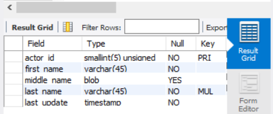
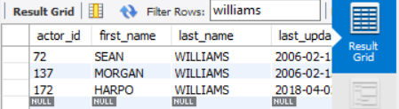
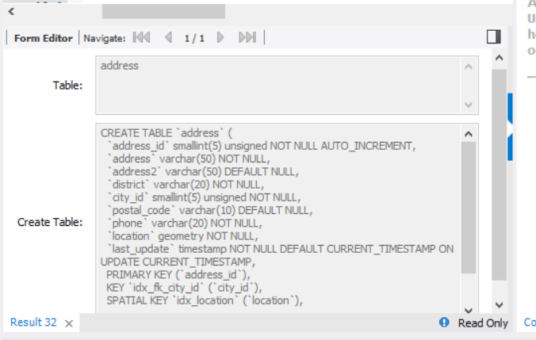
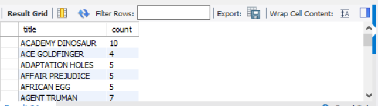
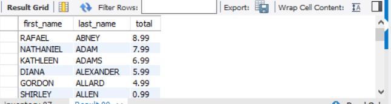

# 1a. Display the first and last names of all actors from the table actor.
            

select first_name, last_name from actor;

## 1b. Display the first and last name of each actor in a single column in upper case letters. Name the column Actor Name.

select CONCAT (first_name,' ',last_name) as 'Actor Name' from actor;

# 2a. You need to find the ID number, first name, and last name of an actor, of whom you know only the first name, "Joe." What is one query would you use to obtain this information?

select actor_id, first_name, last_name from actor where first_name='Joe';

# 2b. Find all actors whose last name contain the letters GEN:

select * from actor where last_name like '%GEN%';

## 2c. Find all actors whose last names contain the letters LI. This time, order the rows by last name and first name, in that order:

select last_name, first_name from actor where last_name like '%%LI%%' order by last_name, first_name;

## 2d. Using IN, display the country_id and country columns of the following countries: Afghanistan, Bangladesh, and China:

select country_id, country from country where country IN ('Afghanistan', 'Bangladesh', 'China');

## 3a. Add a middle_name column to the table actor. Position it between first_name and last_name. Hint: you will need to specify the data type.

alter table actor add column middle_name varchar(100) after first_name;

## 3b. You realize that some of these actors have tremendously long last names. Change the data type of the middle_name column to blobs.

alter table actor modify column middle_name blob;

desc actor;

## 3c. Now delete the middle_name column.

alter table actor drop middle_name;

desc actor;

## 4a. List the last names of actors, as well as how many actors have that last name.

select last_name, count(*) as count from actor group by last_name order by count desc;

## 4b. List last names of actors and the number of actors who have that last name, but only for names that are shared by at least two actors

select last_name, count(*) as count from actor group by last_name having count >=2 order by count desc;

## 4c. Oh, no! The actor HARPO WILLIAMS was accidentally entered in the actor table as GROUCHO WILLIAMS, the name of Harpo's second cousin's husband's yoga teacher. Write a query to fix the record.

update actor set first_name='HARPO' WHERE actor_id=172;

SELECT * FROM ACTOR;

## 4d. Perhaps we were too hasty in changing GROUCHO to HARPO. It turns out that GROUCHO was the correct name after all! In a single query, if the first name of the actor is currently HARPO, change it to GROUCHO. Otherwise, change the first name to MUCHO GROUCHO, as that is exactly what the actor will be with the grievous error. BE CAREFUL NOT TO CHANGE THE FIRST NAME OF EVERY ACTOR TO MUCHO GROUCHO, HOWEVER! (Hint: update the record using a unique identifier.)

update actor set first_name='Mucho Groucho' WHERE actor_id=172;

SELECT * FROM ACTOR;

## 5a. You cannot locate the schema of the address table. Which query would you use to re-create it?

Hint: https://dev.mysql.com/doc/refman/5.7/en/show-create-table.html

show create table address;

## 6a. Use JOIN to display the first and last names, as well as the address, of each staff member. Use the tables staff and address:

select staff.first_name, staff.last_name, address.address from staff join address on staff.address_id=address.address_id;

## 6b. Use JOIN to display the total amount rung up by each staff member in August of 2005. Use tables staff and payment.

select staff.first_name, staff.last_name, sum(payment.amount) as total from staff join payment on staff.staff_id=payment.staff_id where payment.payment_date like "2005-08%" group by staff.first_name;

## 6c. List each film and the number of actors who are listed for that film. Use tables film_actor and film. Use inner join.

select film.title, count(film_actor.actor_id) as count from film inner join film_actor on film.film_id=film_actor.film_id group by film.title;

## 6d. How many copies of the film Hunchback Impossible exist in the inventory system?

select film.title, count(inventory.inventory_id) as count from film join inventory on film.film_id=inventory.inventory_id where film.title like "%Hunchback Impossible%"; 

## 6e. Using the tables payment and customer and the JOIN command, list the total paid by each customer. List the customers alphabetically by last name:

select customer.first_name, customer.last_name, sum(payment.amount) as total from customer join payment on customer.customer_id=payment.payment_id group by customer.last_name;

